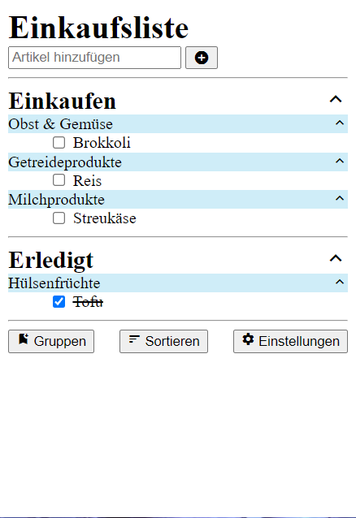
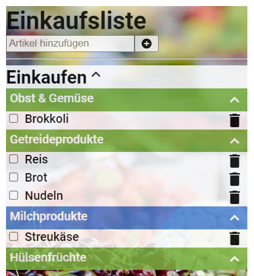

# Einkaufsliste HTML-Code
Dieses Repository enthält den HTML- und JavaScript-Code für die Einkaufsliste, welche im Modul "Grundlagen der Programmierung" des Kurses "Mobile App Development" entwickelt wird.

Die HTML-Entwicklungsschritte sind in den Dateien "html1.html" und "html2.html" enthalten.

Die HTML-Aufgaben befinden sich hier:  
[html1.md](html1.md)  
[html2.md](html2.md)  

Endergebnis HTML

Das Endergebnis des HTML-Teils kann z.B. so aussehen:

Die JavaScript-Entwicklungsschritte befinden sich in den Verzeichnissen "lektion1" bis "lektion10" 

Endergebnis JavaScript

Das Endergebnis des JavaScript-Teils kann z.B. so aussehen:

Die Aufgabe der Kursteilnehmer ist es, die Einkaufsliste jeden Tag ein wenig weiterzuentwickeln.
