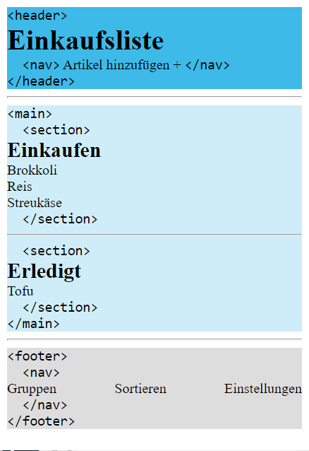
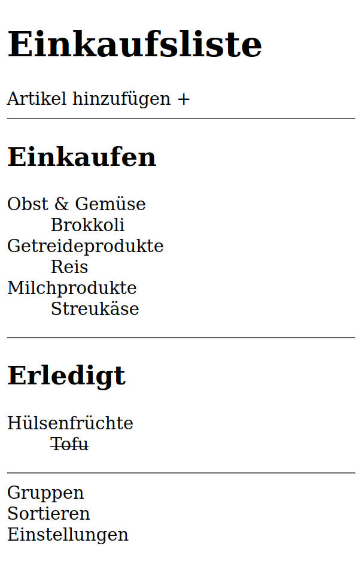

<h1 align="center">HTML</h1>
<h3 align="center">Lektion 1</h3>
<br>

#### Beschreibung:

- Hier könnte auch ein Zitat, Witz, Gedicht etc. stehen, oder am Besten Meme!

#### Hinweise zur Bearbeitung:

- Achte auf einen sauberen Quellcode, insbesondere Einrückungen sind wichtig!
- ...

---


<details>
<summary>Aufgabe 1</summary>

**Versuche einzelne Aufgaben nicht zu lang werden zu lassen.**

Beschreibe hier die Teilaufgabe, und/oder in welches file die Aufgabe geschrieben werden soll.
1. Erstelle hier ausführltichere Unteraufgaben.
    - Auflistungen können so gestaltet werden
    - *italic*, **bold**, ***bold & italic***, ~~durchgstrichen~~
    - `Buzzwords` sehen so aus
    - CodeBlocks:
   ```
     static gruppenListe = []
     static aktiveGruppe = null
   ```
2. ...


</details>

---
<details>
<summary>Zwischenergebnis</summary>

Beschreibung der neuen Funktionen und der Änderungen.
>
</details>

---

<details>
<summary>Aufgabe 2</summary>

Beschreibe hier die Teilaufgabe, und/oder in welches file die Aufgabe geschrieben werden soll.
1. Erstelle hier ausführltichere Unteraufgaben.
    - Auflistungen können so gestaltet werden
    -
    - ...
2. ...
</details>

---

<details>
<summary>Zwischenergebnis</summary>

Beschreibung der neuen Funktionen und der Änderungen.
>

</details>

---

<details>
<summary>Endergebnis</summary>
Ausführliche Beschreibung über alle neuen Funktionen und Änderungen.
Zusammenfassung

>

</details>


