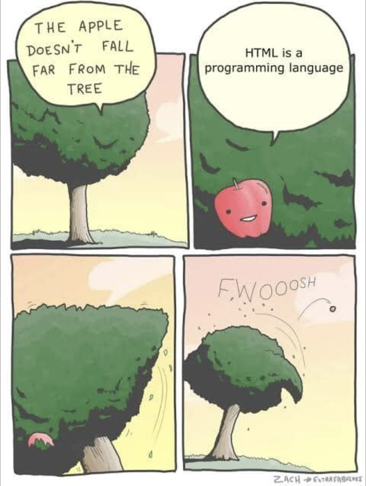
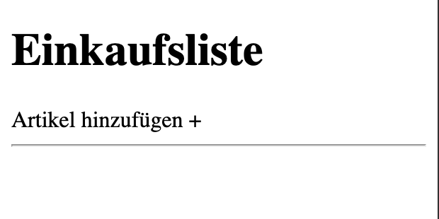
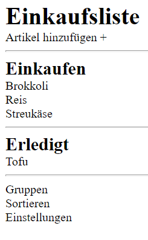
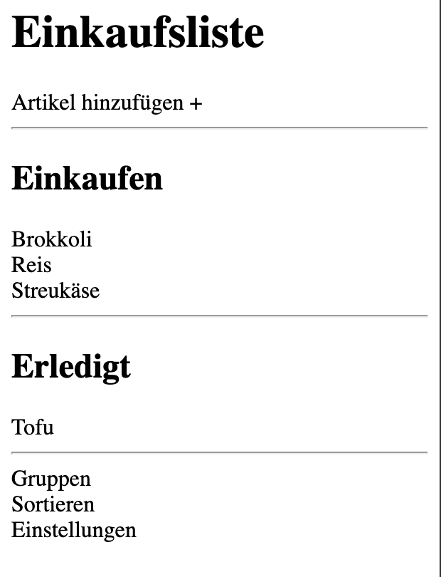

<h1 align="center">HTML</h1>
<h3 align="center">Lektion 1</h3>
 

  

#### Beschreibung:

- Dies ist deine erste Coding-Challenge!
- In dieser Lektion erstellen wir einen Prototyp der Einkaufslisten-App 🛒.

#### Hinweise zur Bearbeitung:

- Achte auf einen sauberen Quellcode, insbesondere Einrückungen sind wichtig.
- Die App kann nach deiner eigenen Vorstellung angepasst werden. Sei kreativ!
- Die Antwort zu jedem Problem lässt sich durch die richtige Suche im Web finden.
- Wenn du Hilfe brauchst, frage gerne Google, andere Teilnehmer oder die Tutoren. Es gibt keine dummen Fragen!

---

Aufgabe 1

In der HTML-Datei, `html-lektion1.html` findest du bereits ein erstes HTML Konstrukt. Dieses enthält die 
äußeren `<html>`-Tags mit einem `<head>`-Tag.
1. Erstelle innerhalb des `<head>`-Tags die `<title>`-Tags. Dieser Titel kann zum Beispiel Einkaufslisten-App heißen. 
2. Nun soll in den ersten Abschnitt der Seite folgendes eingefügt werden:
- Eine Überschrift `Einkaufsliste` in Schriftgröße `h1`,
- Ein frei stehender Text `Artikel hinzufügen +` und
- Eine horizontale Linie

---

Zwischenergebnis

Durch das Erstellen all der neuen HTML-Komponenten, sollte deine App nun ungefähr so aussehen:

  

---

Aufgabe 2

Als Nächstes fügen wir die folgenden Abschnitte hinzu:

1. Der zweite Abschnitt wird die Liste der noch nicht gekauften Waren. Folgende Elemente können eingefügt werden:
- Einen Text `Einkaufen` in Schriftgröße `h2`
- Die drei Artikel `Brokkoli`, `Reis` und `Streukäse`, jeweils mit einem Zeilenumbruch am Ende
- Eine horizontale Linie zum Abschluss
2. Es folgt der Abschnitt mit den bereits gekauften Waren. Hierzu wieder folgendes einfügen:
- Einen Text `Erledigt` in Schriftgröße `h2`
- Einen Artikel `Tofu` mit abschließendem Zeilenumbruch
- Eine horizontale Linie zum Abschluss
3. Wir schließen die Aufgabe 2 ab, indem wir die drei Texte `Gruppen`, `Sortieren`, `Einstellungen` in **jeweils**
   einem eigenen `div`-Element ans Ende des Dokumentes schreiben.

---

Zwischenergebnis

Durch das Erstellen all der neuen HTML-Komponenten, sollte deine App nun ungefähr so aussehen:

  

---

Aufgabe 3

In dieser Aufgabe bringen wir etwas mehr Form in deine HTML-App
1. Unterteile die Webseite mit den entsprechenden Tags in Header, Main und Footer.
- Header: `Einkaufsliste` bis `Artikel hinzufügen +`
- Main: `Einkaufen` bis `Tofu`
- Footer: `Gruppen` bis `Einstellungen`
2. Unterteile die Rubrik "Einkaufen" und "Erledigt" mitsamt ihrer Unterpunkte in zwei verschiedene Sections.
Dies geschieht mithilfe von `<section>`-Tags.
3. Der Text `Artikel hinzufügen +` soll innerhalb eines `<nav>`-Elements stehen. Setze dies um.
4. Auch die Texte im Footer sollen **gemeinsam** innerhalb **eines** weiteren `<nav>`-Elements stehen.
5. Umschließe nun die `<header>`, `<main>` und die `<footer>` Section mit einem einzigen `<body>`-Tag

---

Endergebnis

Die App hat sich jetzt zwar kaum verändert, aber es gehört nun mal zu den best-practices, die App in 
verschiedene Bereiche einzuteilen.   

  

  

