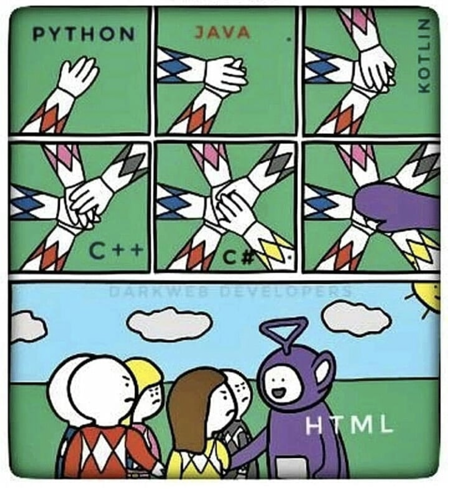
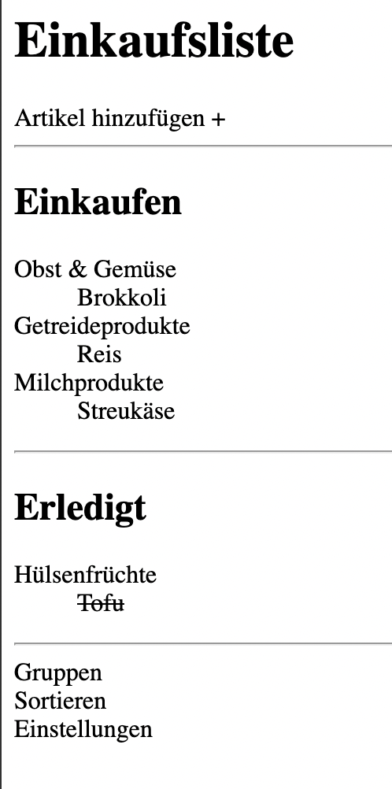
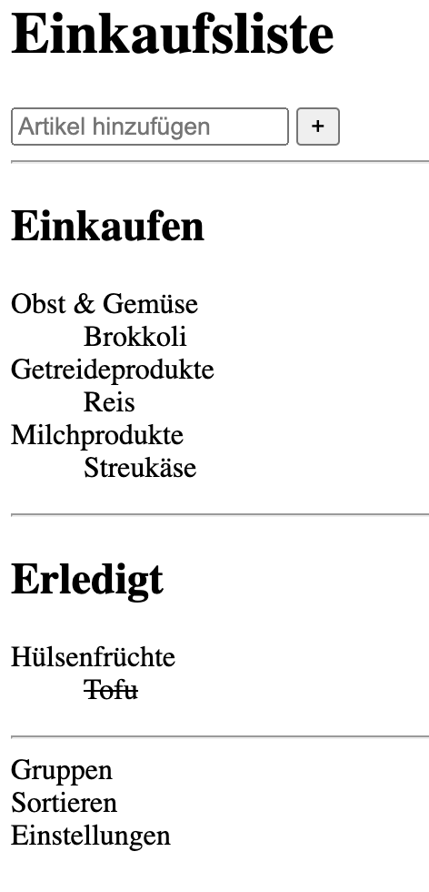
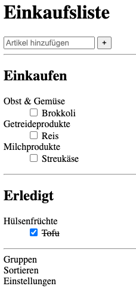
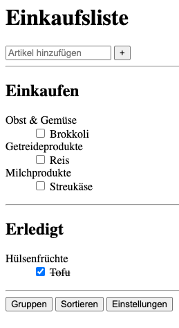
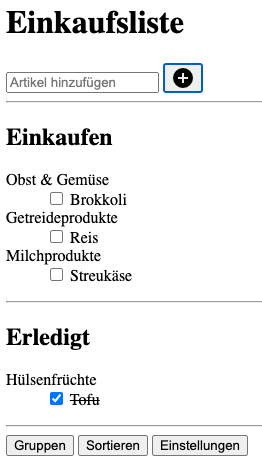
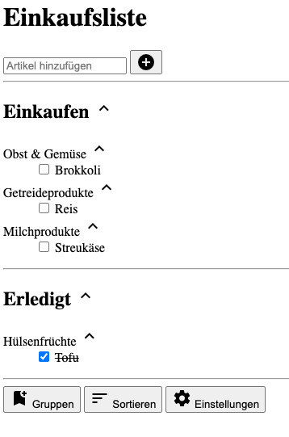
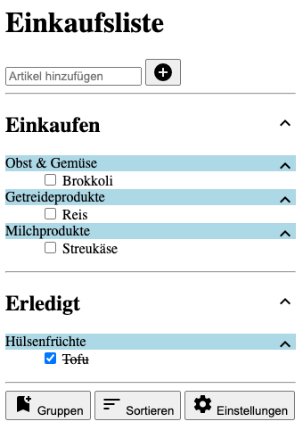

<h1 align="center">HTML</h1>
<h3 align="center">Lektion 2</h3>
<br>

<p align="center">
  
</p>

####Beschreibung:

- In dieser Lektion arbeiten wir weiter an einem Prototypen der Einkaufslisten-App.
- Wir werden die HTML-Datei aus Lektion 1 weiter bearbeiten und aus statischem Text Listen, Eingabefelder und Buttons 
kreieren.


####Hinweise zur Bearbeitung:

- Achte auf einen sauberen Quellcode, insbesondere Einrückungen sind wichtig.
- Die App kann nach deiner eigenen Vorstellung angepasst werden. Sei kreativ!
- Die Antwort zu jedem Problem lässt sich durch die richtige Suche im Web finden.
- Wenn du Hilfe brauchst, frage gerne Google, andere Teilnehmer oder die Tutoren. Es gibt keine dumme Fragen.

---

<details>
<summary>Aufgabe 1</summary>

Als ersten Schritt, wollen wir die Elemente in den beiden `<section>` Bereichen in Listen umwandeln. 
Gehe hierzu wie folgt vor:
1. Erstelle unter der `<h2>` Überschrift eine `<dl>`-Liste
2. In jeder `<dl>`-Liste gibt es `<dt>`-Elemente und zu jedem `<dt>`-Element gibt es ein oder mehrere `<dd>`-Elemente. 
Die Waren sollen jeweils im `<dd>`-Bereich stehen
3. Im `<dt>` Bereich sollen die vier Titel `Obst und Gemüse`, `Getreideprodukte`, `Milchprodukte`, `Hülsenfrüchte` stehen
4. Ein Element Item, z.B. `Tofu` soll durchgestrichen sein

</details>

---

<details>
<summary>Zwischenergebnis</summary>

Super! Jetzt werden die Bereiche "Einkaufen" und "Erledigt" als Listen angezeigt, mit jeweils verschiedenen Untergruppen.
<p>
  
</p>
</details>

</details>

---

<details>
<summary>Aufgabe 2</summary>

Nun soll der `<header>`-Bereich bearbeitet werden. Führe hierzu folgendes durch:
1. `Artikel hinzufügen` muss in ein Input-Feld umgewandelt werden. Der Eingabetyp ist `text` und der Placeholder der Text
"Artikel hinzufügen"
2. Das `+` soll in einen `<button>` umgewandelt werden

</details>

---
<details>
<summary>Zwischenergebnis</summary>

"Artikel Hinzufügen" ist nun ein Eingabefeld und das "+" ein Button. Jedoch haben beide keine Funktion, da hierzu eine 
Anbindung an beispielsweise JavaScript benötigt wird.<br><br>
<p>
  
</p>
</details>

---

<details>
<summary>Aufgabe 3</summary>

Nun bearbeiten wir wieder die Listen-Elemente. In jedes `<dd>` Element muss nun eine Checkbox eingebaut werden.
- Packe hierfür jeden Text in einem `<dd>`-Element in einen `<label>`-Tag.
- Erstelle innerhalb der `<label>`-Tags einen Tag des Types "checkbox"
- Füge eine Anweisung hinzu, damit die durchgestrichene Ware bereits ein Häckchen ind der Checkbox hat 

</details>

---

<details>
<summary>Zwischenergebnis</summary>

Jedes Waren-Element hat nun eine Checkbox, die sich anklicken lässt. Außerdem hat in dem Beispiel "Tofu" bereits eine
abgehakte Checkbox.
<p>
  
</p>
</details>

---

<details>
<summary>Aufgabe 4</summary>

Ändere in dieser kurzen Aufgabe, die 3 `<div>`-Elemente im `<footer>`, sodass sie als Buttons angezeigt werden.
</details>


---

<details>
<summary>Zwischenergebnis</summary>

Die 3 unteren Elemente, werden als Buttons angezeigt.
<p>
  
</p>
</details>

---

<details>
<summary>Aufgabe 5</summary>

Nun, wollen wir einen `style`-link zu unserem html-Dokument hinzufügen. 
1. Im `<head>`-Tag müssen wir hierzu folgenden HTML-Tag hinzufügen: 
   ```
   <link rel="stylesheet" href="https://fonts.googleapis.com/icon?family=Material+Icons">
   ```
2. Nun füge folgende Attribute dem Button im `<header>` hinzu: 
   - `class`:`material-icons` 
   - `style`:`vertical-align: bottom`
   - Ändere den Text zu 'add_circle'

</details>

---

<details>
<summary>Zwischenergebnis</summary>

Durch das hinzufügen eines `styleheets`, können bereits vorhandene designs, die sich bewährt haben einfach übernommen 
werden, ohne diese z.B. mittels `CSS`, selbst aufwändig zu erstellen.
<p>
  
</p>
</details>

---


<details>
<summary>Aufgabe 6</summary>

Die letzte html-Aufgabe ändert nun noch das Design im `<main>`- und `<footer`-Bereich.
1. Füge jeweils folgenden Code in der `<main>` zu den anschließenden Elementen hinzu: 
   ```
   <i class="material-icons">expand_less</i>
   ```
   - Zu den Überschriften "Einkaufen" und "Erledigt": 
   - Zu allen Gruppen (z.B. Obst, Gemüse, Getreide, ...)
2. Im `<footer>` füge folgenden Code den buttons hinzu: 
   ```
   <span class="material-<icons"></span>
   ```
   Als Tag-Inhalt von `<span>`, füge folgende styles hinzu: 
   - `bookmark_add`
   - `sort`
   - `settings`


</details>

---

<details>
<summary>Endergebnis</summary>

Die App hat sich jetzt zwar kaum verändert, aber es gehört nun mal zu den best-practices, die App in
verschiedene Bereiche einzuteilen. <br><br>
<p>
  
</p>
</details>

---

<details>
<summary>ZUSATZ</summary>

Um die neu eingefügten Icons rechtsbündig anzuzeigen und den Hintergrund der Gruppen-Namen einzufärben, müsst ihr
`style`-Attribute verwenden.   
**Hinweis**: `style`-Attribute nehmen ein CSS-Attribut. 
Die Antwort zu diesem Problem, könnt ihr durch eine geschickte Suche auf 
www.google.de finden 🕵️‍

<p>
  
</p>🔎
</details>


<br><br>
