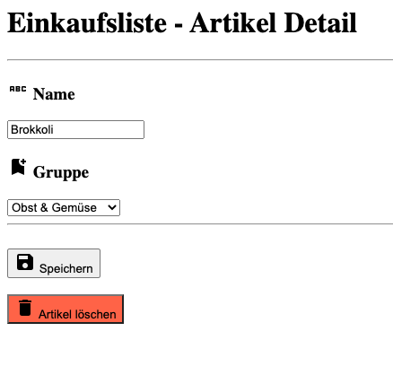
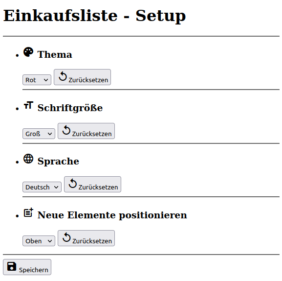
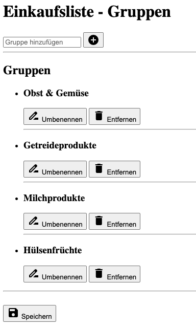
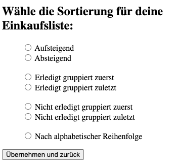

<h1 align="center">HTML</h1>
<h3 align="center">Lektion 3 - ZUSATZ</h3>
 

  

####Beschreibung:

- In dieser Lektion arbeiten wir an weitere Layouts für den Prototypen unserer Einkaufslisten-App.

####Hinweise zur Bearbeitung:

- Achte auf einen sauberen Quellcode, insbesondere Einrückungen sind wichtig.
- Die App kann nach deiner eigenen Vorstellung angepasst werden. Sei kreativ!
- Die Antwort zu jedem Problem lässt sich durch die richtige Suche im Web finden.
- Wenn du Hilfe brauchst, frage gerne Google, andere Teilnehmer oder die Tutoren. Es gibt keine dumme Fragen.

---

Aufgabe 1

Als ersten Schritt, wollen wir eine Ansicht erstellen, um Artikel hinzuzufügen, zu löschen und zu bearbeiten.
1. Erstelle eine neue HTML Datei `artikelpflegen.html`
2. Der User soll auf dieser Seite einen bereits angelegten Artikel bearbeiten können. Gebe der Seite hierfür eine passende Überschrift
3. Erstelle ein Textfeld in welchem der User einen neuen Artikelnamen eingeben kann. Gebe dem Textfeld außerdem einen "Default value" welches "Brokkoli" sein soll.
4. Erstelle unter dem Textfeld ein "Aufklappmenü", in welchem sich eine Gruppe auswählen lässt, falls der Nutzer diese ändern will (Obst & Gemüse, Getreideprodukte, Milchprodukte, Hülsenfrüchte).  
5. Ergänze die Seite so, dass sowohl über dem Textfeld als auch über dem Aufklappmenü eine kleine Überschrift steht (Name und Gruppe). Füge links neben der Überschrift auch noch ein passendes Icon ein.
6. Füge Buttons zum Speichern und Löschen des Artikels hinzu und nutze hierbei passende Material Icons.
7. Unterteile die Seite sinnvoll in `<header>`, `<main>` und `<footer>`
8. Verschönere die Seite ein wenig, indem die Bereiche mittels `
` etwas von einander abtrennst
9. Ergänze die HTML Seite um einen <head> Titel mit Metaangabe.
10. Ändere die Farbe deines "Löschen" Buttons, sodass dieser in einem Rot erscheint. 
    Versuche herauszufinden wie das möglich ist.

---

Ergebnis

Super! Du hast nun eine Ansicht erstellt, um Artikel zu bearbeiten. Durch Klicken auf einen der beiden Buttons, wird man
auf die Ansicht der Einkaufsliste zurück geführt. Artikel lassen sich jedoch nicht hinzufügen, löschen oder bearbeiten.

  

---

Aufgabe 2

In dieser Aufgabe erstellen wir die Ansicht für das Setup.
1. Erstelle eine neue HTML-Datei `setup.html` und füge den Link zu dieser Datei in dem zugehörigen Button im Hauptfenster ein, sodass der User per klick auf die neue Seite gelangt.
2. Füge auf die neue Seite die Überschrift `Einkaufsliste - Setup` in die Header-Section ein. Trenne diesen Bereich vom Rest mit einer horizontalen Linie
3. Erstelle eine unsortierte Liste im `main` Bereich der Seite und füge darin vier Listenelemente ein
4. Jedes Listenelement besteht auf folgenden Bestandteilen:
   - Einer Überschrift in Schriftgröße `h3` wobei in der Überschrift, aber vor dem Text ein Material-Icon eingebaut wird
   - Einem Select-Element
   - Einem Button mit der Beschriftung `Zurücksetzen` und einem Icon vor dem Text in dem Button
   - Einer horizontalen Linie zwischen zwei `li` Elementen
5. Die vier Listenelemente sollen wie oben abgebildet beschriftet werden. Die Icons findest du bei https://fonts.google.com/icons und können an die passenden Stellen eingefügt werden. In den Spinner-Elementen soll folgendes zur Auswahl stehen:
   - Thema: Rot, Blau, Grün, Lila
   - Schriftgröße: Groß, Mittel, Klein
   - Sprache: Deutsch, Englisch
   - Neue Elemente positionieren: Oben, Unten
6. Zum Abschluss muss der `footer` erstellt werden. Trenne ihn vom `main` Bereich durch eine horizontale Linie. Füge einen "Speichern"-Button ein, der den User wieder zurück zur Hauptseite bringt

---

Ergebnis

Super! Du hast nun eine Ansicht erstellt, um die Farbe, Sprache, Schriftgröße zu ändern und neue Elemente zu positionieren. 
Durch Klicken auf einen den "Speichern"-Button, wird man auf die Ansicht der Einkaufsliste zurückgeführt. 
Jedoch hat das Ändern bisher keine Funktion.
  

  

---

Aufgabe 3

1. Erstelle eine neue HTML Datei `gruppen.html`.
2. Der User soll auf dieser Seite die Gruppen in der Einkaufsliste verwalten können. Gebe der Seite hierfür eine passende Überschrift
3. Erstelle eine Liste welche vorhanden die Gruppen (Obst & Gemüse, Getreideprodukte, Milchprodukte, Hülsenfrüchte) anzeigt. Mache dies mit dem `<ul>` Tag. Die Namen der Gruppen sollen außerdem innerhalb von `<h3>`stehen.  
   Grenze mittels `
` die Gruppen noch etwas deutlicher voneinander ab.
4. Füge unter jeden Gruppentitel einen Button "Umbennen" und "Entfernen" hinzu.  
5. Ergänze die Seite ganz oben, noch vor deiner Gruppenliste um ein Textfeld "Gruppe hinzufügen". Platziere direkt daneben einen passenden Button.  
   Nutze gerne `
` um die Bereiche visuell stärker voneinander abzutrennen.
6. Unterteile die Seite sinnvoll in `<header>`, `<main>` und `<footer>`
7. Ergänze die HTML Seite um einen <head> Titel mit Metaangabe.
8. Ergänze alle Buttons mit passenden Material Icons.
9. Verlinke den Button "Speichern", sodass er zurück zu deiner Hauptseite "Einkaufsliste" führt. Verlinke auch dort einen Button "Gruppen" so dass er zu deiner neu angelegten HTML Seite führt.

---

Ergebnis

Super! Du hast nun eine Ansicht erstellt, um Gruppen hinzuzufügen, umzubenennen und zu entfernen.
Durch Klicken auf einen den "Speichern"-Button, wird man auf die Ansicht der Einkaufsliste zurückgeführt.
Jedoch hat das Ändern der Gruppen bisher keine Funktion.

  

---

Aufgabe 4

In dieser Aufgabe wollen wir einen Sortierdialog erstellen.
1. Verlinke und umfasse in `html1.html` den `Sortieren` - Button
   - Tag: `a href`: `sortieren.html`
2. Erstelle ein neues html file `sortieren.html`
3. Gib der Seite eine passende Überschrift, woraus erkennbar wird, was ein user hier später machen soll 
4. Erstelle eine Liste mit radioboxes und den folgenden captions:
   - Kopiere folgenden code für eine radiobox in ein Listenelement `<dd>`:`<input type="radio" id="auf" name="Sortierung" value="Aufsteigend">
     <label for="auf"> Aufsteigend</label>`
   - Verwende die folgenden Sortierungsmöglichkeiten:
     - `Aufsteigend`
     - `Absteigend`
     - `Erledigt gruppiert zuerst`
     - `Erledigt gruppiert zuletzt`
     - `Nicht erledigt gruppiert zuerst`
     - `Nicht erledigt gruppiert zuletzt`
     - `Alphabetisch`
   - Passe für jedes Listenelement die Werte für `id`, `label for`, sowie die label caption (s.o.) an
   - Erstelle weitere Sortierungsmöglichkeiten 
5. Erstelle einen footer und verlinke darin einen Button `Übernehmen und zurück` auf eine neue Seite `sortiert.html`
6. Erstelle die neue Seite `sortiert.html`
7. Übernimm darin den code aus `html1.html` und verändere die Liste so, dass sie alphabetisch wird.

---

Ergebnis

Nun ist auch noch die letzte Ansicht für die Buttons im `<footer>` fertig gestellt. Dieser Sortierdialog, führt von 
`html1.html` auf die html-file `sortieren.html` und über den "Übernehmen und Zurück"-Button auf `sortiert.html`.

  

  
