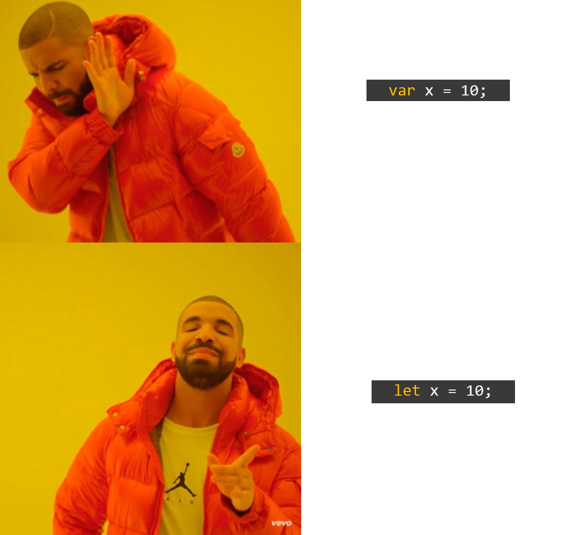
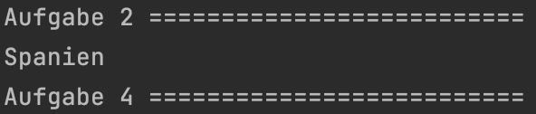
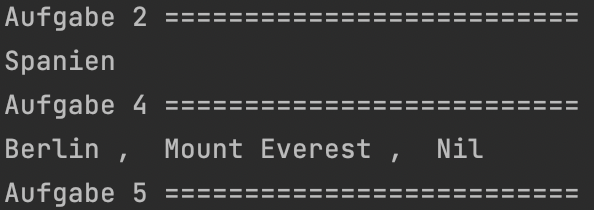
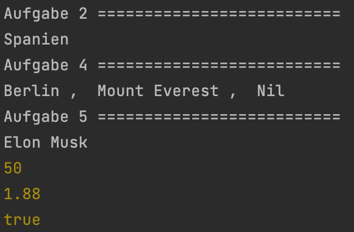

<h1 align="center">JavaScript</h1>
<h3 align="center">Lektion 1: Übungsaufgabe</h3>
 

#### Beschreibung:

- In dieser Aufgabe erstellen wir unsere ersten Variablen!
>
#### Hinweise zur Bearbeitung:

- Achte auf einen sauberen Quellcode, insbesondere Einrückungen sind wichtig!
- Dies ist eine Übungsaufgabe und dient nur als **Zusatzaufgabe**. Das Bearbeiten der
  Hauptaufgaben ist das jeweilige Ziel der einzelnen Lektionen und sollte als Priorität angesehen werden!

---

Aufgabe 1

Erstelle eine Variable mit dem Namen `land` und gib ihr den Wert `Spanien`.  
**Hinweis:** Benutze hierfür das Schlüsselwort `let`.

___

Aufgabe 2

Sehr gut! Gebe nun die soeben erstellte Variable in der console aus. Hierfür habe ich dir die Funktion
`console.debug()` schon vorgegeben. Du musst nur noch auf "Run" drücken! Schaue dir das Zwischenergebnis an und vergleiche
es mit deiner Ausgabe!

___

Zwischenergebnis

Das Ganze sollte ungefähr so in deiner Konsole aussehen. Stresse dich nicht, wenn es nicht GENAU so bei dir aussieht. Wichtig 
ist nur, dass der Name deiner Variablen dort steht. Ignoriere auch alles was unterhalb von Aufgabe 4 steht. Dazu kommen wir, 
wenn wir die anderen Aufgaben bearbeiten!  
>

---

Aufgabe 3

Als Nächstes erstelle mehrere Variablen auf einmal. Trenne diese mit einem Komma und benutze wieder das Schlüsselwort `let`.  
Die gewünschten Variablen sind: `stadt`, `berg`, `fluss`.  
**Hinweis:** Du musst deinen Variablen keinen Wert geben.

---

Aufgabe 4

In der letzten Aufgabe haben wir Variablen erstellt. Nun geben wir diesen Variablen Werte. Als `stadt` wollen wir `Berlin`,
als `berg` wollen wir `Mount Everest` und als `fluss` wollen wir `Nil`.

---

Zwischenergebnis

Das Ganze sollte ungefähr so in deiner Konsole aussehen. Stresse dich nicht, wenn es nicht GENAU so bei dir aussieht. Wichtig
ist nur, dass die Namen deiner Variablen dort stehen. Ignoriere auch alles was unterhalb von Aufgabe 5 steht. Dazu kommen wir,
wenn wir die letzte Aufgabe bearbeiten!
>

---

Aufgabe 5

Sehr gut! Wir sind fast fertig! Bisher haben wir nur Variablen mit Namen benutzt. Wie du aber bereits aus der Vorlesung weißt,
gibt es auch noch andere Arten von Variablen. Als letzte Aufgabe sollst du nun mehrere Variablen deklarieren und ihnen anschließend 
Werte geben. Ob du jede Variablen einzeln deklarierst und ihr gleich den Wert gibst (Bsp.: `let land = "Spanien";`) oder zuerst 
alle Variablen deklarierst und ihnen anschließend die Werte gibst (Bsp.: `let land; land = "Spanien";`) ist dir Überlassen.  
Folgend die gewünschten Variablen und Werte:  
`name`: `Elon Musk`  
`alter`: `50`  
`groesseInMeter`: `1.88`  
`amLeben`: `true`

---

Endergebnis

In dieser Übung hast du noch einmal gesehen, wie man Variablen auf verschiedene Weise erstellen kann und das es von diesen
verschiedene Typen gibt. Am Ende sollte es bei dir ungefähr so aussehen:  

>

