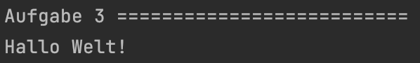

<h1 align="center">JavaScript</h1>
<h3 align="center">Lektion 2: Übungsaufgabe</h3>
 

#### Beschreibung:

- Willkommen in der Vielfalt von Arrays
>
#### Hinweise zur Bearbeitung:

- Achte auf einen sauberen Quellcode, insbesondere Einrückungen sind wichtig!
- Dies ist eine Übungsaufgabe und dient nur als **Zusatzaufgabe**. Das Bearbeiten der
  Hauptaufgaben ist das jeweilige Ziel der einzelnen Lektionen und sollte als Priorität angesehen werden!

---

Aufgabe 1

Im Gegensatz zu Variablen kann ein Array mehrere Werte speichern. Jeder Wert hat hier einen Index. Über diesen können
wir auf den entsprechenden Wert zugreifen.   
Als Erstes erstellen wir ein Array `Laender`. In diesem sollen die Länder `USA`, `Spanien`, `Frankreich`, `Deutschland` und 
`Japan` vorkommen. Lass dir das Ganze einmal ausgeben. Die console.debug für die die Ausgabe haben wir dir bereitgestellt.

___

Zwischenergebnis

Das Ganze sollte ungefähr so in deiner Konsole aussehen. Stresse dich nicht, wenn es nicht GENAU so bei dir aussieht. Wichtig
ist nur, dass alle Länder ausgegeben werden. Ignoriere auch alles, was
unterhalb von Aufgabe 2 steht. Dazu kommen wir, wenn wir die anderen Aufgaben bearbeiten!
>

---

Aufgabe 2

Perfekt! Manchmal haben wir aber auch einfach Arrays vorgegeben oder automatisch generiert. Wir müssen auch fähig sein,
mit diesen zu arbeiten. Gehe nun bitte einmal hin und schaue, wie lang das vorgegebene Array `helden` ist. Benutze dazu die
Funktion `length()`. 

___

Zwischenergebnis

Das Ganze sollte ungefähr so in deiner Konsole aussehen. Stresse dich nicht, wenn es nicht GENAU so bei dir aussieht. Wichtig
ist nur, dass die Laenge des Arrays ausgegeben wird. Ignoriere auch alles, was unterhalb von Aufgabe 3 steht. Dazu kommen
wir, wenn wir die anderen Aufgaben bearbeiten!
>

---

Aufgabe 3

Wie du bereits weißt, können wir per Index direkt auf bestimmte Werte im Array zugreifen. Greife auf das erste und letzte
Element des Arrays zu und gebe diese aus. Schreibe dazu hier selbst auch die `console.debug` Funktion.  
**Hinweis:** Vergiss nicht, dass ein Array beim zaehlen immer mit 0 anfängt!

___

Zwischenergebnis

Das Ganze sollte ungefähr so in deiner Konsole aussehen. Stresse dich nicht, wenn es nicht GENAU so bei dir aussieht. Wichtig
ist nur, dass `Hallo Welt!` ausgegeben wird. Ignoriere auch alles, was unterhalb von Aufgabe 4 steht. Dazu kommen
wir, wenn wir die anderen Aufgaben bearbeiten!
>

---

Aufgabe 4

Fügen wir nun einmal ein Element an den Anfang einer Liste hinzu! Du hast wieder ein Array vorgegeben. Benutze die bekannte
Funktion `unshift()` um `Brot` an den Anfang der Liste `warenkorb` zu setzen!

___

Zwischenergebnis

Das Ganze sollte ungefähr so in deiner Konsole aussehen. Stresse dich nicht, wenn es nicht GENAU so bei dir aussieht. Wichtig
ist nur, dass das Brot am Anfang der Liste steht. Ignoriere auch alles, was unterhalb von Aufgabe 5 steht. Dazu kommen wir,
wenn wir die anderen Aufgaben bearbeiten!
>

---

Aufgabe 5

Sehr gut! Wir sind fast fertig! Nun schauen wir uns als Vorletztes einmal an, wie man ein Element aus einer Liste heraus
löscht. Lösche die Elemente `x`, `y` und `z` in der Mitte unseres Arrays buchstaben. Benutze hierzu die bekannte Funktion
splice()`.

___

Zwischenergebnis

Das Ganze sollte ungefähr so in deiner Konsole aussehen. Stresse dich nicht, wenn es nicht GENAU so bei dir aussieht. Wichtig
ist nur, dass die Buchstaben a, b, c und d ausgegeben werden. Ignoriere auch alles, was unterhalb von Aufgabe 6 steht.
Dazu kommen wir, wenn wir die anderen Aufgaben bearbeiten!
>

---

Aufgabe 6

Zu guter Letzt erstellen wir jetzt noch ein Array, welches aus unterschiedlichen Daten besteht. Hier gebe einfach ein paar Daten
über dich ein! In dem Array `developer` soll de`n `Vorname`, dein `Nachname`, dein `Alter`, deine `Groesse` in Metern und ob du diese Aufgabe
erledigt hast oder nicht stehen! Wenn du nicht richtig weißt, wie du alle Datentypen angeben sollst, dann schau dir einmal
das Endergebnis an. Wenn du noch immer nicht weiter weißt, dann helfen wir Tutoren dir sehr gerne weiter!

___

Endergebnis

In dieser Übung hast du zum ersten Mal Arrays gesehen, bearbeitet und auch selbst geschrieben. Die Lösungen für Aufgaben 
1 bis 5 sind jeweils in den Zwischenergebnissen, allerdings bekommst du hier nochmal alles auf einen Blick. Am Ende sollte
es bei dir ungefähr so aussehen:

> Aufgabe 1:  
> Aufgabe 2:  
> Aufgabe 3:  
> Aufgabe 4:  
> Aufgabe 5:  
> Aufgabe 6:

