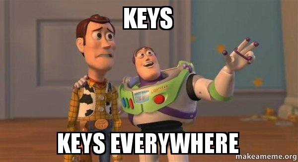
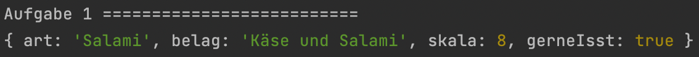
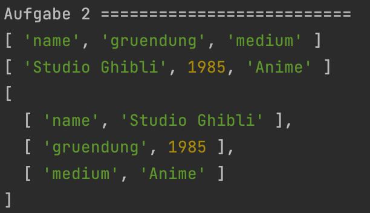
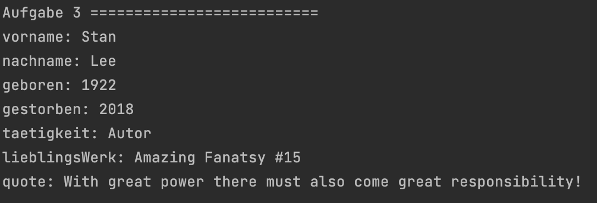

<h1 align="center">JavaScript</h1>
<h3 align="center">Lektion 5: Übungsaufgabe</h3>
 

#### Beschreibung:

- Los gehts mit maps, keys und values!
>
#### Hinweise zur Bearbeitung:

- Achte auf einen sauberen Quellcode, insbesondere Einrückungen sind wichtig!
- Dies ist eine Übungsaufgabe und dient nur als **Zusatzaufgabe**. Das Bearbeiten der
  Hauptaufgaben ist das jeweilige Ziel der einzelnen Lektionen und sollte als Priorität angesehen werden!

---

Aufgabe 1

Erstelle deine erste map! Nenne diese `pizza`. In Pizza soll stehen, was für eine `Art` von Pizza es ist, was für einen `Belag`
sie hat, von einer `Skala` von 1 bis 10 wie gut sie schmeckt und ob es `wahr` ist, dass du Sie `gerneIsst`.  
**Hinweis:** Wenn du dir unsicher bist, dann schau doch nochmal auf Folie 5 von Lektion 3 nach.

___

Zwischenergebnis

Das Ganze sollte ungefähr so in deiner Konsole aussehen. Stresse dich nicht, wenn es nicht GENAU so bei dir aussieht. Wichtig
ist nur, dass alle Schlüssel und Werte ausgegeben werden. Ignoriere auch alles, was unterhalb von Aufgabe 2 steht. 
Dazu kommen wir, wenn wir die anderen Aufgaben bearbeiten!
>

---

Aufgabe 2

Um das Verständnis der einzelnen Teile der map zu vertiefen, gehen wir jetzt nochmal genauer auf diese ein. Eine map ist 
bereits vorgegeben. Schreibe jeweils in jede der debug Funktionen eine Ausgabe für die `keys`, die `values` und die `entries`. 

___

Zwischenergebnis

Das Ganze sollte ungefähr so in deiner Konsole aussehen. Stresse dich nicht, wenn es nicht GENAU so bei dir aussieht. Wichtig
ist, dass einmal die keys, die values und einmal beide zusammen ausgegeben werden. Ignoriere auch alles, was unterhalb von 
Aufgabe 3 steht. Dazu kommen wir, wenn wir die anderen Aufgaben bearbeiten!
>!

---

Aufgabe 3

Im Prinzip hast du nun bereits das relativ kurze Thema maps gemeistert! Abschließend sollst du noch einmal eine map schreiben,
um ein wenig uebung zu bekommen. In der map `kuenstler` sollen mindestens 5 entries über deinen Lieblingskuenstler stehen. 
Wie du das Ganze gestaltest und was du dort reinschreibst, kannst du frei wählen. Um ein Beispiel zu sehen schaue einmal 
in das Endergebnis unter Aufgabe 3 nach.  
**Hinweis:** Lass dich nicht von dem vorgegebenen code mit `for` verwirren. Auf for Schleifen gehen wir in einer späteren 
Lektion genauer ein.

___

Endergebnis

In dieser Uebung hast du zum ersten Mal deine eigenen Maps geschrieben und ihre einzelnen Bestandteile näher kennengelernt. 
Die Lösungen für Aufgaben 1 bis 2 sind jeweils in den Zwischenergebnissen, allerdings bekommst du hier nochmal alles auf
einen Blick. Am Ende sollte es bei dir ungefähr so aussehen:

> Aufgabe 1:  
> Aufgabe 2:  
> Aufgabe 3:

