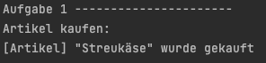
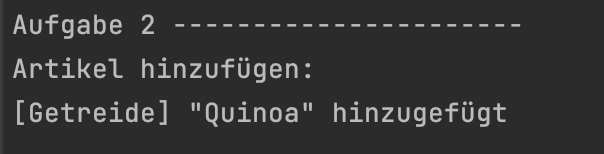
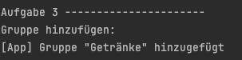
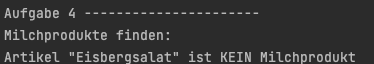
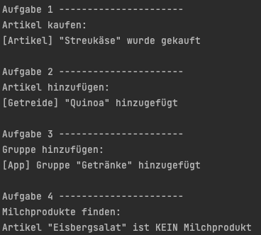
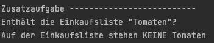

<h1 align="center">JavaScript</h1>
<h3 align="center">Lektion 1</h3>
 

  

#### Beschreibung:

- Dies ist die erste Lektion, in der wir an der Einkaufslisten-App arbeiten werden 🛒.

#### Hinweise zur Bearbeitung:

- Die Datei `lektion4.js`soll für diese Lektion bearbeitet werden
- Das Testen der Aufgaben funktioniert über die Datei `test4.js` in "lektion4/test/test4.js"
- Achte auf einen sauberen Quellcode, insbesondere Einrückungen sind wichtig!
- Die App kann nach deiner eigenen Vorstellung angepasst werden. Sei kreativ!
- Die Antwort zu jedem Problem lässt sich durch die richtige Suche im Web finden.
- Wenn du Hilfe brauchst, frage gerne Google, andere Teilnehmer oder die Tutoren.

---

Aufgabe 1

Gehe zum Bearbeiten der Lektion zur Datei `lektion4.js` in "lektion4/js/lektion4.js"
In dieser Aufgabe schreiben wir eine Abfrage, die zurückgeben soll, ob ein bestimmter Artikel bereits gekauft wurde. 
In diesem Beispiel "Streukäse". Hierzu sind folgende Schritte notwendig: 
1. Schreibe eine Variable `artikelName` und fülle sie mit dem Wert Streukäse.
2. Schreibe eine Variable `artikelGekauft` und fülle sie mit dem Wert true.
3. Wenn `artikelGekauft` wahr ist, dann gib Folgendes auf der Konsole aus:  
   [Artikel] "`artikelName`" wurde gekauft

---

Zwischenergebnis

Durch das Ausführen der Datei test4.js soll folgendes auf der Konsole ausgegeben werden:

  

---

Aufgabe 2

In der Funktion `artikel_Hinzufuegen()` soll überprüft werden, ob `artikelName` NICHT leer ist und somit hinzugefügt
werden kann. 
1. Schreibe eine Variable `gruppenName` und fülle sie mit dem Wert Getreide.
2. Schreibe eine Variable `artikelName` und fülle sie mit dem Wert "Quinoa".
3. Prüfe, ob der `artikelName` leer ist.
4. Wenn der `artikelName` NICHT leer ist, dann gib Folgendes auf der Konsole aus:
   [`gruppenName`] "`artikelName`" hinzugefügt

---

Zwischenergebnis

Durch das Ausführen der Datei test4.js soll folgendes auf der Konsole ausgegeben werden:

  

---

Aufgabe 3

Innerhalb der Funktion `gruppe_Hinzufuegen()` soll eine Logik programmiert werden, die auf der Konsole ausgibt, dass 
eine neue Gruppe hinzugefügt wurde, falls diese `neueGruppe` nicht bereits im leeren Array `gleicheGruppe` existiert. 
Dies soll geschehen, indem nur überprüft wird, ob das Array `gleicheGruppe` leer ist. 
Ansonsten, soll eine Warnung ausgegeben werden.
1. Erstelle ein leeres Array namens `gleicheGruppen`
2. Schreibe eine Variable `neueGruppe` und fülle sie mit dem Wert Getränke
3. Wenn `gleicheGruppen` leer ist, dann gib Folgendes auf der Konsole aus:
   [App] Gruppe "`neueGruppe`" hinzugefügt
4. Ansonsten gib folgende Warnung auf der Konsole aus: 
[App] Gruppe "`neueGruppe`" existiert schon!

---

Zwischenergebnis

Durch das Ausführen der Datei test4.js soll folgendes auf der Konsole ausgegeben werden:

  

---

Aufgabe 4

Erstelle in dieser Aufgabe, eine switch-case-Anweisung, die überprüft, ob ein `artikel`, im Gruppen-Array `Milchprodukte`
vorkommt. Hierzu kannst du in folgenden Schritte vorgehen: 
1. Fülle ein Array `milchProdukte` mit den Werten Milch, Joghurt und Sahne.
2. Fülle eine Variable `artikel` mit dem Wert Eisbergsalat
3. Schreibe ein `switch`-Statement, welches überprüft, ob der `artikel` in `milchProdukte` vorkommt.  
**Hinweis:** Die einzelnen Array-Einträge können direkt als `case` benutzt werden.
   - Wenn ja, dann gib Folgendes auf der Konsole aus: Artikel "`artikel`" ist ein Milchprodukt
   - Wenn nicht, dann gib Folgendes auf der Konsole aus: Artikel "`artikel`" ist KEIN Milchprodukt

---

Endergebnis

Durch das Ausführen der Datei test4.js soll folgendes auf der Konsole ausgegeben werden:

  

Insgesamt sieht das Konsolen-Ergebnis wie folgt aus:

  

---

Zusatzaufgabe

Durch den Code in der Funktion `zusatz_ìndexOf()`, soll herausgefunden werden, ob der Artikel "Tomaten" in dem Array 
`einkaufsliste` vorhanden ist. Dies kann in folgenden Schritten gemacht werden: 
1. Fülle ein Array `einkaufsliste` mit den Werten Tofu, Milch, Butter und Honig.
2. Prüfe mithilfe von `indexOf()`, ob "Tomaten" in dem Array `einkaufsliste` vorkommen. Gebe jeweils eine passenden Satz
auf der Konsole aus

---

Ergebnis

Durch das Ausführen der Datei test4.js soll folgendes auf der Konsole ausgegeben werden:

  

  

