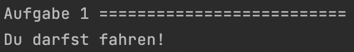
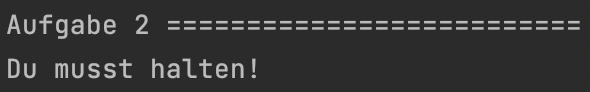
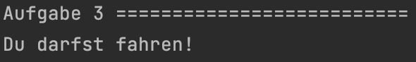
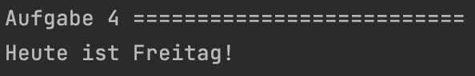
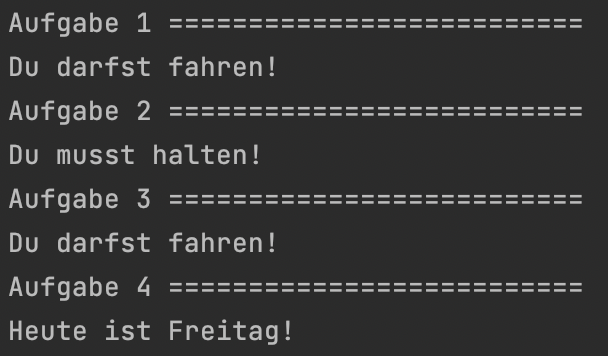

<h1 align="center">JavaScript</h1>
<h3 align="center">Lektion 4: Übungsaufgabe</h3>
<br>

#### Beschreibung:

- In dieser Aufgabe betreten wir die Welt der Bedingungen!
>
#### Hinweise zur Bearbeitung:

- Achte auf einen sauberen Quellcode, insbesondere Einrückungen sind wichtig!
- Dies ist eine Übungsaufgabe und dient nur als **Zusatzaufgabe**. Das Bearbeiten der
  Hauptaufgaben ist das jeweilige Ziel der einzelnen Lektionen und sollte als Priorität angesehen werden!

---

<details>
<summary>Aufgabe 1</summary>

Willkommen zu deiner ersten Aufgabe zum Thema Bedingungen! Als Start programmieren wir eine if-Abfrage. Im Code der ersten
Aufgabe siehst du bereits die `Variable ampel` vorgegeben. Diese ist `gruen`. Wie wir alle wissen, darf man bei gruen losfahren.
Allerdings weiß unser Code das noch nicht! Schreibe eine `if-Abfrage`, die nur ausgeführt wird, wenn die Ampel auch wirklich
gruen ist. Trifft dies zu, soll `Du darfst fahren!` ausgegeben werden.  
**Hinweis:** Eine if-Abfrage kann so aussehen: 
```
if (Bedingung eins == Bedingung zwei) {
   auszuführender Code
} 
```
Um einen Satz auszugeben, benutze die bereits bekannte `console.debug()` Funktion.

</details>

___

<details>
<summary>Zwischenergebnis</summary>

Das Ganze sollte ungefähr so in deiner Konsole aussehen. Stresse dich nicht, wenn es nicht GENAU so bei dir aussieht. Wichtig
ist nur, dass dort steht, dass du losfahren darfst. Ignoriere auch alles was unterhalb von Aufgabe 2 steht. Dazu kommen wir,
wenn wir die anderen Aufgaben bearbeiten!
>

</details>

---

<details>
<summary>Aufgabe 2</summary>

Super! Nachdem du jetzt bereits deine erste if-Abfrage geschrieben hast, wird die Zweite noch viel leichter! Wie du siehst,
ist unsere Variable `ampel` in Aufgabe 2 `rot`. Logischerweise müssen wir also anhalten. Um es aber etwas interessanter zu machen,
schreibe eine if-Abfrage, welche zutrifft, wenn die Variable ampel `NICHT gruen` ist! Innerhalb der Abfrage soll dann, wie in 
Aufgabe 1, etwas ausgegeben werden. Diesmal soll aber `Du musst halten!` ausgegeben werden!  
**Hinweis:** Um zu vergleichen, ob etwas nicht gleich ist, benutzt man `!=`.

</details>

___

<details>
<summary>Zwischenergebnis</summary>

Das Ganze sollte ungefähr so in deiner Konsole aussehen. Stresse dich nicht, wenn es nicht GENAU so bei dir aussieht. Wichtig
ist nur, dass dort steht, dass du halten musst. Ignoriere auch alles was unterhalb von Aufgabe 3 steht. Dazu kommen wir,
wenn wir die anderen Aufgaben bearbeiten!
>

</details>

---

<details>
<summary>Aufgabe 3</summary>

Super! Du bist jetzt der Meister des If's. Was ist aber mit dem Else? Dazu kommen wir jetzt! Wie du in der Aufgabe siehst,
ist unsere `Variable ampel` wieder `gruen`. Du kannst im Endeffekt jetzt deine `if-Abfrage aus Aufgabe 1` hier einsetzten. Jetzt
hast du sogar schon ausgegeben, was im Zwischenergebnis auch steht! Wir sind aber noch nicht fertig. Nach deiner if-Abfrage
schreibe eine `else-Abfrage`. In dieser soll dann über `console.debug` `Du musst halten!` ausgegeben werden. Wenn also die
Ampel jetzt nicht gruen ist, musst du in jedem anderen Fall halten! Wenn du noch einen Moment Zeit hast, wechsel einfach mal
den Wert der Variable ampel von `gruen` zu `rot`. Auch `gelb`, `blau` oder `Hund` funktioniert! Wie du siehst, musst du hier 
immer anhalten.

</details>

---

<details>
<summary>Zwischenergebnis</summary>

Das Ganze sollte ungefähr so in deiner Konsole aussehen. Stresse dich nicht, wenn es nicht GENAU so bei dir aussieht. Wichtig
ist nur, dass dort steht, dass du losfahren darfst. Vergiss aber nicht die Else Abfrage! Ignoriere auch alles was unterhalb 
von Aufgabe 4 steht. Dazu kommen wir, wenn wir die anderen Aufgaben bearbeiten!
>

</details>

---

<details>
<summary>Aufgabe 4</summary>

Und damit sind wir nun mit if und else fertig. Glueckwunsch! Wir koennen aber noch nicht Feierabend machen. Es fehlt naemlich
noch die switch-Abfrage. Diesmal haben wir eine `Variable tag`. Diese hat den Wert `5`. Unsere Aufgabe ist es nun, einen `switch`
fuer die Wochentage zu programmieren, damit an Tag 5 `Heute ist Freitag!` ausgegeben wird. Dieser switch soll einen Fall fuer
jeden Wochentag haben, bei dem immer in gleicher Form ausgegeben werden soll, welchen Tag wir haben. Also in `Fall 1` sollte 
`Heut ist Montag!` stehen, in `Fall 3` `Heute ist Mittwoch!` und so weiter. Final sollte noch `allgemein` `Die Woche hat genau 7 Tage!` 
ausgegeben werden, sollte man andere Werte als 1 bis 7 fuer die Variable tag haben. Ganz wichtig! Vergiss die `breaks` nicht!  
**Hinweis:** Eine switch-Abfrage mit verschiedenen Fällen (cases) sieht wie folgt aus:
```
switch(Bedingung bzw. Variable) {
    case 1: 
       Hier der Code
       break;
    case 2:
       Hier der Code
       break;
    .
    .
    .
    default:
       Hier dein Code    
}
```

</details>

---

<details>
<summary>Zwischenergebnis</summary>

Das Ganze sollte ungefähr so in deiner Konsole aussehen. Stresse dich nicht, wenn es nicht GENAU so bei dir aussieht. Wichtig
ist nur, dass dort steht, dass heute freitag ist. Wenn du Lust hast, kannst du auch mal andere Werte für die Variable tag
einsetzen und schauen, was dann passiert!
>

</details>

---

<details>
<summary>Endergebnis</summary>
In dieser Übung hast du noch einmal gesehen, wie man verschiedene Arten von Bedingungen programmiert. Du hast if-else und
switch-Abfragen gemeistert und bist nun bereit, diese selbst anzuwenden! Am Ende sollte es bei dir ungefähr so aussehen:  

>

</details>