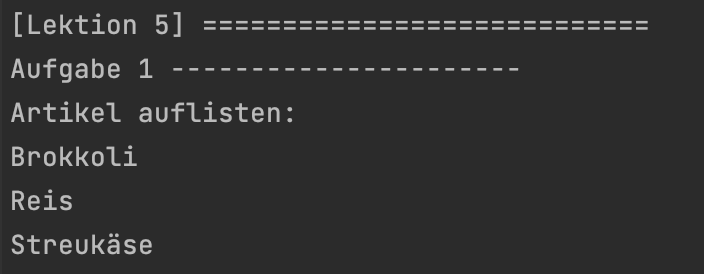
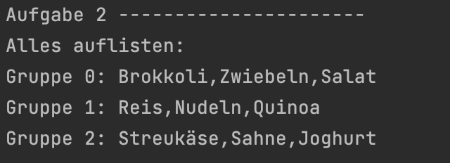
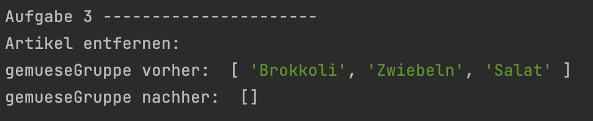
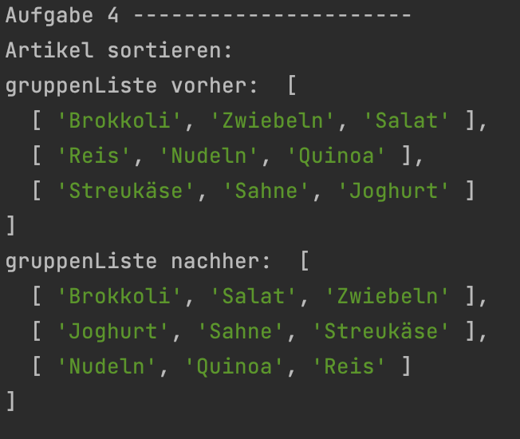

<h1 align="center">JavaScript</h1>
<h3 align="center">Lektion 5</h3>
 

>

#### Beschreibung:

- In dieser Lektion werden wir weitere Funktionen der Einkaufslisten-App programmieren 🛒.

#### Hinweise zur Bearbeitung:

- Die Datei `lektion5.js`soll für diese Lektion bearbeitet werden in `"lektion5/js/lektion5.js"`
- Das Testen der Aufgaben funktioniert über die Datei `test5.js` in `"lektion5/test/test5.js"`
- Achte auf einen sauberen Quellcode, insbesondere Einrückungen sind wichtig!
- Die App kann nach deiner eigenen Vorstellung angepasst werden. Sei kreativ!
- Wenn du Hilfe brauchst, frage gerne Google, andere Teilnehmer oder die Tutoren.

---

Aufgabe 1

Schreibe innerhalb der Funktion `artikelAuflisten()` Code, welcher die einzelnen Elemente eines Arrays ausgibt.  
**Pseudocode:**
1. Schreibe ein Array `artikelListe` und fülle es mit Brokkoli, Reis und Streukäse.
2. Baue eine Schleife deiner Wahl, um die Artikel des Arrays auf der Konsole. auszugeben.

---

Zwischenergebnis

Durch das Ausführen der Datei test5.js soll folgendes bei Aufgabe 1 auf der Konsole ausgegeben werden:
Dies muss nicht genau so formatiert sein.

  

---

Aufgabe 2

Schreibe innerhalb der Funktion `allesAuflisten()` Code, der den Inhalt mehrerer Arrays auf der Konsole ausgibt  
**Pseudocode:**
1. Schreibe ein Array `gemueseListe` und fülle es mit Brokkoli, Zwiebeln und Salat.
2. Schreibe ein Array `getreideListe` und fülle es mit Reis, Nudeln und Quinoa.
3. Schreibe ein Array `milchListe` und fülle es mit Streukäse, Sahne und Joghurt.
4. Füge die letzten 3 Arrays zur `gruppenListe` mit [push()](https://www.mediaevent.de/javascript/array-push-pop.html)
   hinzu.
5. Baue eine [for-i-Schleife](https://www.mediaevent.de/javascript/for-loop.html) und gib die Gruppen-Nummer sowie die
   Artikel auf der Konsole aus.

---

Zwischenergebnis

Durch das Ausführen der Datei test5.js soll folgendes auf der Konsole ausgegeben werden:

  

---

Aufgabe 3

In der Funktion `artikelEntfernen()` soll aus dem Array `gemueseListe` die Elemente mit Hilfe einer Schleife entfernt
werden  
**Pseudocode:**
1. Schreibe ein Array `gemueseListe` und fülle es mit Brokkoli, Zwiebeln und Salat.
2. Füge die `gemueseListe` der `gruppenListe` mit `push()` hinzu.
3. Gib den Inhalt der `gemueseListe` auf der Konsole aus.
4. Baue eine for-i-Schleife über die `gemueseListe` und entferne das jeweils 1. Element mit [splice(0, 1)](https://www.mediaevent.de/javascript/array-slice.html)
   oder mit [pop()](https://developer.mozilla.org/de/docs/Web/JavaScript/Reference/Global_Objects/Array/pop).
5. Gib den Inhalt der `gemueseListe` nochmals auf der Konsole aus.

---

Zwischenergebnis

Durch das Ausführen der Datei test5.js sollte zuerst das Array mit Werten ausgegeben werden und anschließend leer
ausgegeben werden

  

---

Aufgabe 4

In der Funktion `sortieren()` sollen 3 Arrays innerhalb des Arrays `gruppenListe` sortiert werden  
**Pseudocode:**
1. Kopiere die Variablen aus Aufgabe 2 `allesAuflisten()`.
2. Schreib den Inhalt der `gruppenListe` mithilfe einer Schleife auf die Konsole (vorher).
3. Baue eine [for-of-Schleife](https://www.mediaevent.de/javascript/for-of.html) über die `gruppenListe` und sortiere
   die jeweilige Gruppe mit [sort()](https://www.mediaevent.de/javascript/sort.html).
4. Sortiere danach auch die `gruppenListe` mit `sort()`.
5. Schreib den Inhalt der `gruppenListe` auf die Konsole (nachher).

---

Endergebnis

Durch das Ausführen der Datei test4.js soll jedes Array alphabetisch sortiert ausgegeben werden.
Auch die Reihenfolge der 3 Arrays sollte sich verändert haben

  

  

