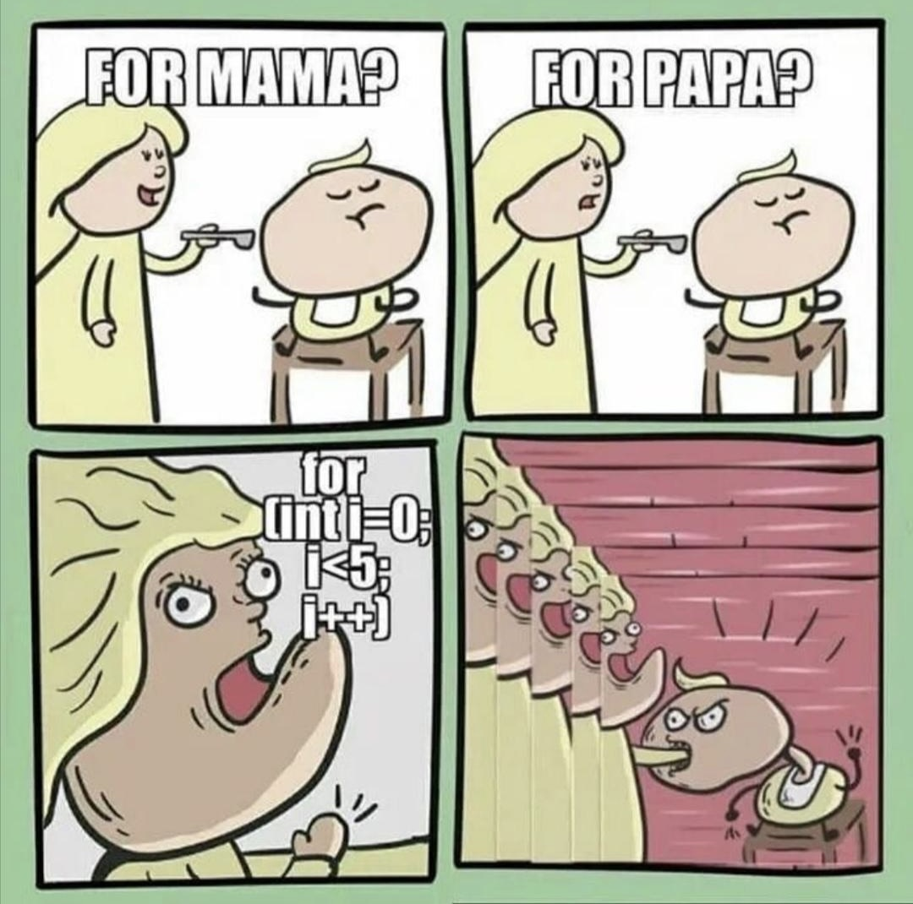

<h1 align="center">JavaScript</h1>
<h3 align="center">Lektion 5: Übungsaufgabe</h3>
 

#### Beschreibung:

- In dieser Aufgabe lernen wir die Schleifen kennen!
>
#### Hinweise zur Bearbeitung:

- Achte auf einen sauberen Quellcode, insbesondere Einrückungen sind wichtig!
- Dies ist eine Übungsaufgabe und dient nur als **Zusatzaufgabe**. Das Bearbeiten der
  Hauptaufgaben ist das jeweilige Ziel der einzelnen Lektionen und sollte als Priorität angesehen werden!

---

Aufgabe 1

Erstelle deine erste for Schleife! Der Anfangswert der Variablen `i` soll `1` entsprechen. Durchlaufe die Schleife insgesamt
5 Mal. Bei jedem Durchlauf soll zunächst Durchlauf `Nummer:` als Text ausgegeben werden, gefolgt von der Nummer des
aktuellen Durchlaufs.

___

Zwischenergebnis

Das Ganze sollte ungefähr so in deiner Konsole aussehen. Stresse dich nicht, wenn es nicht GENAU so bei dir aussieht. Wichtig
ist nur, dass "Durchlauf Nummer:" gefolgt von der Nummer des aktuellen Durchlaufs dort steht. Ignoriere auch alles, was 
unterhalb von Aufgabe 2 steht. Dazu kommen wir, wenn wir die anderen Aufgaben bearbeiten!
>

---

Aufgabe 2

Super! Da du nun weißt, wie eine for Schleife aussieht, können wir break einführen! Wie aus der Vorlesung bekannt ist, bricht
break die Schleife ab. In der Aufgabe ist der größte Teil des Codes bereits vorgegeben. Setze lediglich das Schlüsselwort 
`break` ein und schaue dir an, was du ausgegeben bekommst

___

Zwischenergebnis

Das Ganze sollte ungefähr so in deiner Konsole aussehen. Stresse dich nicht, wenn es nicht GENAU so bei dir aussieht. Wichtig
ist, dass nur Durchlauf 1 und 2 ausgegeben wurden. Ignoriere auch alles, was unterhalb von Aufgabe 3 steht. Dazu kommen 
wir, wenn wir die anderen Aufgaben bearbeiten!
>

---

Aufgabe 3

Der nächste Schritt ist das Schlüsselwort `continue`! Füge an der gegebenen Stelle im code `continue` ein. Beachte, dass diesmal
die `if` Abfrage NICHT vorgegeben ist. Diese soll, wie in Aufgabe 2, bei dem Durchlauf `3` greifen. Somit wird dann bei der Ausgabe 
Durchlauf 3 lediglich übersprungen, anstelle dass die ganze Schleife abbricht.

___

Zwischenergebnis

Das Ganze sollte ungefähr so in deiner Konsole aussehen. Stresse dich nicht, wenn es nicht GENAU so bei dir aussieht. Wichtig
ist nur, dass Durchlauf 3 übersprungen wurden. Ignoriere auch alles, was unterhalb von Aufgabe 4 steht. Dazu kommen
wir, wenn wir die anderen Aufgaben bearbeiten!
>

---

Aufgabe 4

Nun beherrschst du break und continue! Bevor wir jedoch mit den nächsten Schleifenarten weitermachen, kommt jetzt nochmal
ein etwas schwierigeres Konzept der Schleifen. Die Verschachtelung. Aber keine Sorge! Du schaffst das ohne Probleme. Wenn
du doch Hilfe brauchst, wende dich gerne an die Tutoren!  
In dieser Aufgabe sollst du zwei Schleifen schreiben. Die erste Schleife mit der Variablen `i` und die zweite Schleife mit der
Variablen `j`. Die zweite Schleife soll sich innerhalb der ersten befinden. Bei der ersten Schleife soll `i` auf `1` gesetzt
werden. Die Schleife soll insgesamt `3` Mal durchlaufen werden. Für jeden Durchlauf soll `Erste Schleife i:` als Text ausgegeben
werden gefolgt von der Nummer des aktuellen Durchlaufs.  
Bei der zweiten Schleife wird `j` auf `1` gesetzt. Diese Schleife soll insgesamt `2` Mal durchlaufen werden. Für jeden
Durchlauf soll `Zweite Schleife j:` als Text ausgegeben werden gefolgt von der Nummer des aktuellen Durchlaufs.

___

Zwischenergebnis

Das Ganze sollte ungefähr so in deiner Konsole aussehen. Stresse dich nicht, wenn es nicht GENAU so bei dir aussieht. Wichtig
ist nur, dass die zweite Schleife immer zu Ende ausgeführt wird, bevor die erste Schleife ausgeführt wird. Ignoriere auch alles, 
was unterhalb von Aufgabe 5 steht. Dazu kommen wir, wenn wir die anderen Aufgaben bearbeiten!
>

---

Aufgabe 5

Das Schwerste liegt bereits hinter dir! Wir führen jetzt noch zwei Schleifenarten ein und dann hast du das Thema schleifen
gemeistert.  
Die Variable `i` ist bereits definiert. Schreibe nun eine `while` Schleife, welche `5` Mal durchlaufen werden soll. In jedem
Durchlauf gebe die Zahl des aktuellen Durchlaufs aus.

___

Zwischenergebnis

Das Ganze sollte ungefähr so in deiner Konsole aussehen. Stresse dich nicht, wenn es nicht GENAU so bei dir aussieht. Wichtig
ist nur, dass die Zahlen der Durchläufe 1 bis 5 ausgegeben werden. Ignoriere auch alles, was unterhalb von Aufgabe 6 steht. 
Dazu kommen wir, wenn wir die anderen Aufgaben bearbeiten!
>

---

Aufgabe 6

Zu guter Letzt führen wir jetzt noch die do while Schleife ein. Erinnere dich noch einmal daran, wie man in diesem Fall
die Schlüsselwörter do und while verwendet.  
Als Erstes setze deine Variable `i` auf `1`. Als Nächstes schreibe den `do` Abschnitt deiner Schleife. In diesem soll wieder 
die Nummer des aktuellen Durchlaufs ausgegeben und anschließend `i` um eins erhöht werden. Diese Schleife soll `5` mal durchlaufen
werden, was du im `while` Abschnitt festlegst.

___

Zwischenergebnis

Das Ganze sollte ungefähr so in deiner Konsole aussehen. Stresse dich nicht, wenn es nicht GENAU so bei dir aussieht. Wichtig
ist nur, dass die Zahlen der Durchläufe 1 bis 5 ausgegeben werden.
>

---

Aufgabe 7

Diese Aufgabe ist quasi geschenkt! Es ist bereits alles programmiert. Du sollst dir lediglich einmal die essenzielle Fähigkeit
der do while Schleife anschauen. Obwohl die Bedingung nicht zutrifft, wird die Schleife mindestens einmal ausgeführt!

___

Endergebnis

In dieser Übung hast du zum ersten Mal deine eigenen Schleifen geschrieben und verschiedene Arten von Schleifen kennengelernt. 
Die Lösungen für Aufgaben 1 bis 6 sind jeweils in den Zwischenergebnissen, allerdings bekommst du hier nochmal alles auf
einen Blick. Am Ende sollte es bei dir ungefähr so aussehen:

> Aufgabe 1:  
> Aufgabe 2:  
> Aufgabe 3:  
> Aufgabe 4:  
> Aufgabe 5:  
> Aufgabe 6:  
> Ausgabe 7:  

