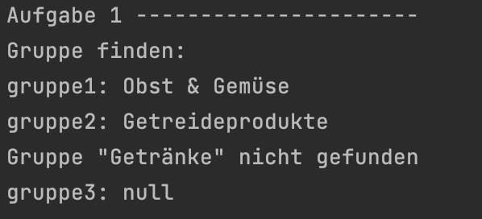
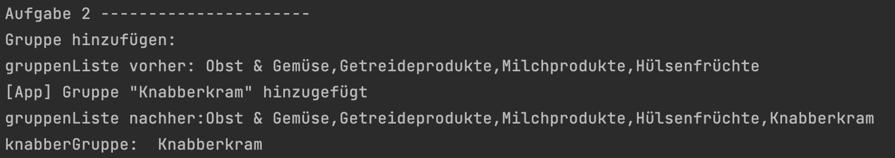
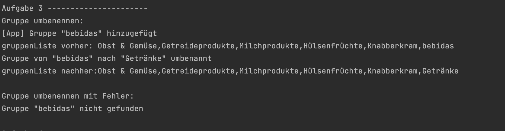
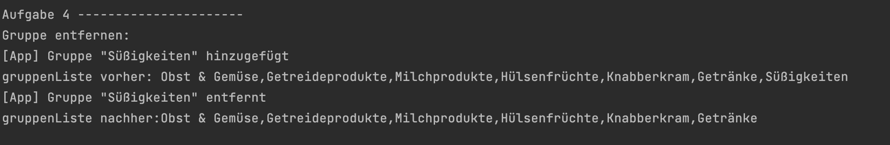

<h1 align="center">JavaScript</h1>
<h3 align="center">Lektion 6</h3>
<br>

<p align="center">
  
</p>

#### Beschreibung:

- In dieser Lektion werden wir weitere Funktionen der Einkaufslisten-App programmieren 🛒.


#### Hinweise zur Bearbeitung:

- Die Datei `lektion6.js` soll für diese Lektion bearbeitet werden in `"lektion6/js/lektion6.js"`
- Das Testen der Aufgaben funktioniert über die Datei `test6.js` in `"lektion6/test/test6.js"`. Diese kann bei Bedarf um
weitere Tests ergänzt werden.
- Achte auf einen sauberen Quellcode, insbesondere Einrückungen sind wichtig!
- Die App kann nach deiner eigenen Vorstellung angepasst werden. Sei kreativ!
- Wenn du Hilfe brauchst, frage gerne Google, andere Teilnehmer oder die Tutoren.

---


<details>
<summary>Aufgabe 1</summary>

Schreibe eine Funktion `gruppeFinden`, die als Parameter einen `gruppenName` nimmt. 
Diese Funktion sucht innerhalb der `gruppenListe` nach einem Element mit dem Namen `gruppenName`.
Wenn so ein Element in der Liste existiert, dann gibt sie dieses Element zurück.
Ansonsten gibt sie eine Warnmeldung aus und liefert `null` zurück.

**Pseudo-Code**
1. Erstelle eine Variable `gruppenIndex` und fülle sie mit dem [indexOf(gruppenName)](https://www.mediaevent.de/javascript/array-indexof.html) der `gruppenListe`.
2. Wenn eine Gruppe gefunden wurde, (der `gruppenIndex` also größer als -1 ist), dann
    - gib das entsprechende Element aus der `gruppenListe` (also an dem Index `[gruppenIndex]`) zurück.
3. Ansonsten
    - gib zum Beispiel folgende Warnung auf der Konsole aus:
    ```
   Gruppe "gruppenName" nicht gefunden
   ```
    - und gib `null` zurück (`return`).

</details>

---
<details>
<summary>Ergebnis</summary>

Durch das Ausführen der Datei test6.js soll folgendes bei Aufgabe 1 auf der Konsole ausgegeben werden:

<p>
  
</p>

</details>

---

<details>
<summary>Aufgabe 2</summary>

**Beschreibung:** Schreibe eine Funktion mit dem Namen `gruppeHinzufuegen` und dem Paramter `name`. 
Diese Funktion fügt zur `gruppenListe` ein neues Element mit dem Namen `name` hinzu.
Die `aktiveGruppe` wird mit der neuen Gruppe gefüllt und die neue Gruppe als Rückgabewert zurückgegeben.
Wenn eine Gruppe mit diesem `name` bereits existiert, dann wird eine Warnmeldung ausgegeben
und null zurückgegeben.

**Pseudo-Code**
1. Schreibe ein Variable `gleicheGruppe` und fülle sie mit dem `indexOf(name)` der `gruppenListe`.
2. Wenn es noch keine Gruppe mit diesem `name` gibt (also `gleicheGruppe` `-1` ist), dann 
   1. lege eine Variable `neueGruppe` mit dem Wert `name` an, 
   2. füge diese `neueGruppe` zur `gruppenListe` hinzu (mit [push()](https://www.mediaevent.de/javascript/array-push-pop.html)), 
   3. weise der `aktiveGruppe` den Wert `neueGruppe` zu (`aktiveGruppe` existiert bereits)
   4. gib folgende Meldung auf der Konsole aus:
   ```
   Gruppe "neueGruppe" hinzugefügt
   ```
   5. und gib die `neueGruppe` als Rückgabewert zurück
3. Ansonsten 
   - gib folgende Warnmeldung auf der Konsole aus:
   ```
   Gruppe "name" existiert schon!
   ```
   - gib null als Rückgabewert zurück


</details>

---

<details>
<summary>Ergebnis</summary>

Durch das Ausführen der Datei test6.js soll folgendes auf der Konsole ausgegeben werden:
<p>
  
</p>

</details>

---

<details>
<summary>Aufgabe 3</summary>

Schreibe eine Funktion `gruppeUmbenennen`, diese hat zwei Parameter als Eingabewerte. `alterName` und
`neuerName`. Diese Funktion sucht eine vorhandene Gruppe mit dem Namen `
alterName` (mithilfe von `gruppeFinden()`) und benennt sie in `neuerName` um.
Danach gibt sie eine Erfolgsmeldung auf der Konsole aus.

**Pseudo-Code**
1. Schreibe ein Variable `vorhandeneGruppe` und fülle sie mit dem Ergebnis von `gruppeFinden(alterName)`.
2. Wenn eine Gruppe gefunden wird (also `vorhandeneGruppe` nicht `null`ist), dann
   1. schreibe eine Variable `index` und fülle sie mit dem `indexOf(alterName)` der `gruppenListe`, 
   2. fülle in der `gruppenListe` das Element an der Stelle `index` mit `neuerName`
   3. gib Folgendes auf der Konsole aus:
   ```
   Gruppe wurde von "alterName" nach "neuerName" umbenannt
   ```
      

</details>

---
<details>
<summary>Ergebnis</summary>
Durch das Ausführen der Datei test6.js sollte folgendes auf der Konsole ausgegeben werden:
<p>
  
</p>

</details>

---
<details>
<summary>Aufgabe 4</summary>

Erstelle eine Funktion `gruppeEntfernen`, diese hat als Eingabewert den Parameter `gruppenName`. 
Diese Funktion sucht eine vorhandene Gruppe mit dem Namen `gruppenName`
(mithilfe von `gruppeFinden()`) und löscht sie aus der `gruppenListe`.
Anschließend gibt sie eine Erfolgsmeldung auf der Konsole aus.
Wenn keine Gruppe mit `gruppenName` gefunden wird,
gibt sie eine Warnmeldung auf der Konsole aus.

**Pseudo-Code**
1. Schreibe eine Variable `entfernGruppe` und fülle sie mit dem Ergebnis von `gruppeFinden(gruppenName)`.
2. Wenn eine Gruppe gefunden wird (also `gruppeFinden` nicht `null` ist), dann
   1. schreibe eine Variable `index` und fülle sie mit dem `indexOf(gruppenName)` der `gruppenListe`,
   2. entferne in der `gruppenListe` das Element an der Stelle `index` mithilfe von [splice(index,1)](https://www.mediaevent.de/javascript/array-slice.html),
   3. gib auf der Konsole Folgendes aus:
   ```
   Gruppe "gruppenName" wurde entfernt
   ```
      
3. Ansonsten
   1. gib auf der Konsole folgende Warnung aus:
   ```
   Gruppe "gruppenName" konnte NICHT entfernt werden
   ```
      

</details>

---
<details>
<summary>Ergebnis</summary>

Durch das Ausführen der Datei test6.js soll folgendes auf der Konsole ausgegeben werden: 
<p>
  
</p>


</details>

<br><br>

