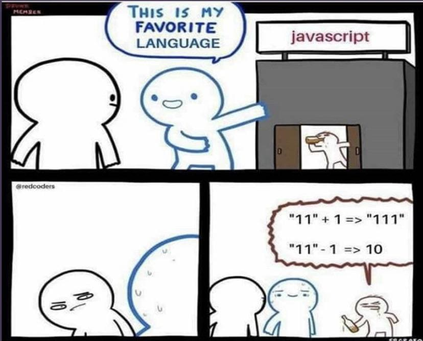
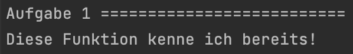
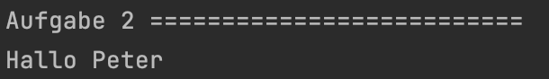
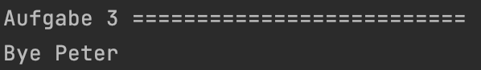
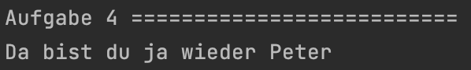
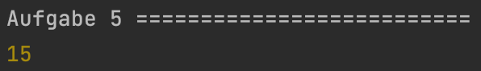
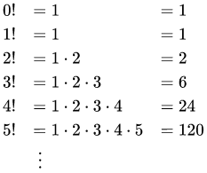
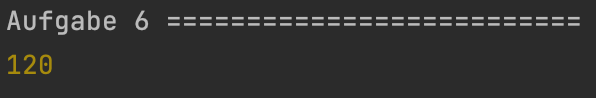

<h1 align="center">JavaScript</h1>
<h3 align="center">Lektion 6: Übungsaufgabe</h3>
 

#### Beschreibung:

- Kommen wir zur Funktion der Funktionen!
>
#### Hinweise zur Bearbeitung:

- Achte auf einen sauberen Quellcode, insbesondere Einrückungen sind wichtig!
- Dies ist eine Übungsaufgabe und dient nur als **Zusatzaufgabe**. Das Bearbeiten der
  Hauptaufgaben ist das jeweilige Ziel der einzelnen Lektionen und sollte als Priorität angesehen werden!

---

Aufgabe 1

Heute Behandeln wir alles rund um das Thema Funktionen! Als Einstieg schreibe die alt bewaehrte `console.debug` Funktion. 
In dieser sollst du den Satz `Diese Funktion kenne ich bereits!` reinschreiben.

___

Zwischenergebnis

Das Ganze sollte ungefähr so in deiner Konsole aussehen. Stresse dich nicht, wenn es nicht GENAU so bei dir aussieht. Wichtig
ist nur, dass der Satz "Diese Funktion kenne ich bereits!" ausgegeben wird. Ignoriere auch alles, was unterhalb von Aufgabe 2 steht.
Dazu kommen wir, wenn wir die anderen Aufgaben bearbeiten!
>

---

Aufgabe 2

Mittlerweile weisst du, wie man eine Funktion schreibt! Wichtige Teile dieser sind die Parameter und die Argumente. In dieser
Aufgabe konzentrieren wir uns zunaechst auf die Parameter. Schreibe eine Funktion mit dem Namen `sagHallo`. Diese soll den 
Parameter `name` haben. In die geschweiften Klammern der Funktion sollst du folgende Zeile schreiben: `console.debug("Hallo " + name)`.
Diese Funktion hilft uns, den Parameter auch in der Konsole auszugeben.

___

Zwischenergebnis

Das Ganze sollte ungefähr so in deiner Konsole aussehen. Stresse dich nicht, wenn es nicht GENAU so bei dir aussieht. Wichtig
ist, dass das Argument `Peter` zusammen mit `Hallo` ausgegeben wird. Ignoriere auch alles, was unterhalb von Aufgabe 3 
steht. Dazu kommen wir, wenn wir die anderen Aufgaben bearbeiten!
>

---

Aufgabe 3

Eben hatten wir den Parameter, jetzt gehen wir über zu dem Argument! Die gegebene Funktion ist fast genau die gleiche, wie 
du sie eben schon einmal geschrieben hattest. Nun musst du die Funktion `sagBye` aufrufen und einen `Namen als Argument` benutzen.
Du kannst dir aussuchen, welchen Namen du nutzt. Im Lösungsbeispiel haben wir einfach erneut Peter genutzt.

___

Zwischenergebnis

Das Ganze sollte ungefähr so in deiner Konsole aussehen. Stresse dich nicht, wenn es nicht GENAU so bei dir aussieht. Wichtig
ist, dass das von dir gewaehlte Argument zusammen mit `Hallo` ausgegeben wird. Ignoriere auch alles, was unterhalb von Aufgabe 4
steht. Dazu kommen wir, wenn wir die anderen Aufgaben bearbeiten!
>

---

Aufgabe 4

Nun sollst du eine vollständige Funktion mit Parameter und Argument selbst schreiben. Schreibe eine Funktion mit dem Namen
`willkommenZurueck`, welche als Parameter `name` haben soll. Benutze in dieser Funktion wieder die `console.debug` Funktion, 
welche zuerst den Text `Da bist du ja wieder` ausgeben soll gefolgt von dem Argument, welches du beim Aufruf der Funktion 
eingibst. Rufe nun die Funktion `willkommenZurueck` auf mit einem Argument deiner Wahl. Das Argument sollte ein Name sein.
In der Zwischenloesung haben wir beispielhaft wieder Peter benutzt.

___

Zwischenergebnis

Das Ganze sollte ungefähr so in deiner Konsole aussehen. Stresse dich nicht, wenn es nicht GENAU so bei dir aussieht. Wichtig
ist nur, dass der Satz "Da bist du ja wieder" gefolgt von deinem gewaehlten Argument ausgegeben wird. Ignoriere auch alles, 
was unterhalb von Aufgabe 5 steht. Dazu kommen wir, wenn wir die anderen Aufgaben bearbeiten!
>

---

Aufgabe 5

Bevor wir nun zu der letzten Aufgabe, der Rekursion, kommen, solltest du vorher noch einmal einen eigenen return geschrieben
haben. Schreibe in dem vorgegebenen Code einen `return`, welcher `a*b` zurueckgeben soll.

___

Zwischenergebnis

Das Ganze sollte ungefähr so in deiner Konsole aussehen. Stresse dich nicht, wenn es nicht GENAU so bei dir aussieht. Wichtig
ist, dass die Zahl 15 ausgegeben wird. Ignoriere auch alles, was unterhalb von Aufgabe 6
steht. Dazu kommen wir, wenn wir die anderen Aufgaben bearbeiten!
>

---

Aufgabe 6

Nun kommen wir zu der Rekursion. **Als Erinnerung:** Rekursion bedeutet, dass die Funktion sich selbst beliebig oft aufruft.
Schreibe eine rekursive Funktion namens `fakulteat` mit einem Parameter `a`, welche die Fakultaet einer bestimmten Zahl ausgibt. 
Vergiss hierbei nicht, die Abbruchbedingung zu schreiben und passend zu waehlen! Ansonsten landest du in einer Endlosschleife.  
**Hinweis:** Eine Fakultaet (geschrieben mit !) ist eine Zahl, die in steigender Reihenfolge multipliziert wird. Sprich 
3! ist 1 mal 2 mal 3. 4! ist 1 mal 2 mal 3 mal. 5! ist 1 mal 2 mal 3 mal 4 mal 5. Hier nochmal ein Bild zur veranschaulichung:
>

___

Endergebnis

In dieser Uebung hast du deine ersten Funktionen geschrieben! Falls dir diese noch schwerfallen, dann keine Sorge. Das Konzept 
der Funktionen wird dir durch uebung immer leichter fallen. Natuerlich kannst du auch, die Tutoren um Hilfe bitten!
Die Lösungen für Aufgaben 1 bis 5 sind jeweils in den Zwischenergebnissen, allerdings bekommst du hier nochmal alles auf
einen Blick. Am Ende sollte es bei dir ungefähr so aussehen:

> Aufgabe 1:
> Aufgabe 2:  
> Aufgabe 3: 
> Aufgabe 4:  
> Aufgabe 5:  
> Aufgabe 6:

