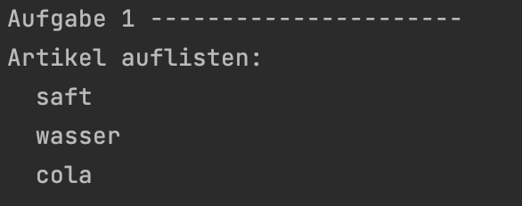
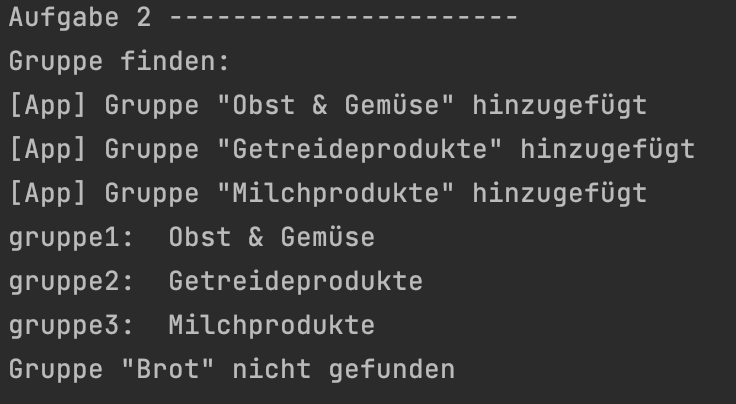

<h1 align="center">JavaScript</h1>
<h3 align="center">Lektion 7</h3>
<br>

<p align="center">
  
</p>

#### Beschreibung:
- In dieser Lektion erstellen wir die Klassen, die wir für die Einkaufslisten-App benötigen!

#### Hinweise zur Bearbeitung:

- Die Datei `Gruppe.js` und `Artikel.js` soll für diese Lektion bearbeitet werden in `"js/Gruppe.js"` und "js/Artikel.js"`
- Das Testen der Aufgaben funktioniert über die Datei `test8.js` in `"lektion7/test/test7.js"`. Diese kann bei Bedarf um
  weitere Tests ergänzt werden.
- Achte auf einen sauberen Quellcode, insbesondere Einrückungen sind wichtig!
- Die App kann nach deiner eigenen Vorstellung angepasst werden. Sei kreativ!
- Wenn du Hilfe brauchst, frage gerne Google, andere Teilnehmer oder die Tutoren.

---
<details>
<summary>Aufgabe 1</summary>

Gehe zuerst in die Datei `Artikel.js`. Erstelle hier die Klasse mit dem Namen `Artikel`. Diese Klasse, soll
die einzelnen Artikelinstanzen verwalten. <br> <br>
Wenn eine neue Artikelinstanz erstellt wird, soll als Parameter `name` und `position` übergeben werden. Weitere properties
der Klasse sind der boolean-wert `gekauft`und `id`. Außerdem wird außerhalb des Konstruktors die Variable `counter` benötigt.  
Diese soll mit `1` initialisiert werden und bei jedem Aufruf der `id` zugewiesen werden und gleichzeitig um eins erhöht werden.
So soll eine eindeutige id erzeugt werden, die für react benötigt wird.<br> <br>

**Pseudocode:**
1. Erstelle eine Klasse mit dem namen `Artikel`
2. Erstelle einen Konstruktor mit den Parametern `name` und `position`. Füge außerdem als weitere properties `gekauft`und `id` hinzu.
3. Erstelle oberhalb des Konstruktors die Variable `counter`. Dieser soll der Wert `1` zugewiesen werden. Außerdem soll der `id` (innerhalb des Kosntruktors)
   dieser `counter` zugewiesen werden und gleichzeitig um eins erhöht werden. Das Zuweisen und Erhöhen kann über folgenden Code innerhalb des Konstruktors erreicht werden: 
```
this.id = Artikel.counter++
```
4. Füge ans Ende der Klasse folgenden Code hinzu:
   ```
   export {Artikel}
   ```
   Dieser Code exportiert die Klasse `Artikel` und macht es für die Datei `test8.js` möglich, diese Klasse und ihre
   Methoden zu testen

</details>

---

<details>
<summary>Aufgabe 2</summary>

Gehe zuerst in die Datei `Gruppe.js`. Erstelle hier die Klasse mit dem Namen `Gruppe`. Diese Klasse, soll
die einzelne Gruppeninstanz verwalten. <br> <br>
Wenn eine neue Gruppeninstanz erstellt wird, soll als Parameter `name` und `index` übergeben werden. Weitere properties
der Klasse sind die `artikelListe`und `id`. Außerdem wird außerhalb des Konstruktors die Variable `counter` benötigt.  
Diese soll mit `1` initialisiert werden und bei jedem Aufruf der `id` zugewiesen werden und gleichzeitig um eins erhöht werden. 
So soll eine eindeutige id erzeugt werden, die für react benötigt wird.<br> <br>

**Pseudocode:** 
1. Erstelle eine Klasse mit dem namen `Gruppe`
2. Erstelle einen Konstruktor mit den Parametern `name` und `index`. Füge außerdem als weitere properties die `artikelListe`und `id` hinzu.
3. Erstelle oberhalb des Konstruktors die Variable `counter`. Dieser soll der Wert `1` zugewiesen werden. Außerdem soll der `id` (innerhalb des Kosntruktors)
dieser `counter` zugewiesen werden und um eins erhöht werden.
4. Füge ans Ende der Klasse folgenden Code hinzu:
   ```
   export {Gruppe}
   ```
   Dieser Code exportiert die Klasse `Gruppe` und macht es für die Datei `test8.js` möglich, diese Klasse und ihre
   Methoden zu testen
5. Füge folgenden import dem Anfang der Klasse hinzu: 
```
import Artikel from './Artikel'
import App from './Shopping'
```

</details>

___


<details>
<summary>Aufgabe 3</summary>

Erstelle nun innerhalb der Klasse `Gruppe` die Methode `artikelAuflisten`, die als Parameter einen boolean-wert  `gekauft` nimmt. Dieser steuert die Anzeige, der bereits gekauften oder noch zu kaufenden Artikel.
Diese Funktion gibt alle Gruppen aus der `gruppenListe` und ihre Artikel auf der Konsole aus. Verwende dafür eine 
for-of-Schleife

**Pseudo-Code:**
1. Schreibe eine Funktion mit dem Namen `ArtikelAuflisten` mit dem Parameter `gekauft`.
2. Erstelle eine for-of-Schleife, die durch die `artikelListe` geht. 
3. für jedes Element der `artikelListe`, soll nun mithilfe einer if-Abfrage überprüft werden, ob `gekauft` gleich `gekauft` ist 
und wenn dies der Fall ist, soll der Artikel ausgegeben werden  <br><br> **Hinweis:** innerhalb der Klasse, können die Elemente wie folgt ausgegeben werden:
```
`${artikel.name}`
```

</details>

___

<details>
<summary>Ergebnis</summary>

Durch das Ausführen der Datei `test7.js`, sollte folgendes auf deiner Konsole ausgegeben werden:
>

</details>


---

<details>
<summary>Aufgabe 4</summary>

In dieser Aufgabe erstellen wir die Klasse `Shopping`. Diese Klasse steuert die Einkaufsliste und enthält die `gruppenListe`.
Sie enthält die zwei properties  `gruppenListe`, `aktiveGruppe` und die Methoden aus Lektion 6 (`gruppeFinden`,
`gruppeHinzufuegen`, `gruppeUmbenennen`, `gruppeEntfernen`). Parameter enthält sie keine.
In dieser Aufgabe testen wir nur die Methode `gruppeFinden`.

**Pseudo-Code:**
1. Schreibe eine Klasse "App" füge folgende properties hinzu:
    - `gruppenListe`
    - `aktiveGruppe`
    - für die Zusatzaufgabe: `setup`
2. Kopiere die Methoden `gruppeFinden`, `gruppeHinzufuegen`, `gruppeUmbenennen` und `gruppeEntfernen` aus der Datei
   `lektion6.js` in diese Klasse hinein
    - entferne jeweils das keyword `function` vor jedem Funktionsnamen
    - setze das keyword `this` jeweils an passender Stelle ein. (**Hinweis:** dies wird benutzt, wenn du auf properties
      der Klasse zugreifen willst)
3. Füge ans Ende der Klasse folgenden Code hinzu:
   ```
   export {Shopping}
   ```
   Dieser Code exportiert die Klasse `Shopping` und macht es für die Datei `test8.js` möglich, diese Klasse und ihre
   Methoden zu testen

</details>

___

<details>
<summary>Ergebnis</summary>

Nun soll in der Datei `test7.js` die Methoden `gruppeHinzufuegen` und `gruppeFinden` getestet werden. Unkommentiere hierzu die
Zeile 43.
>

</details>

---

