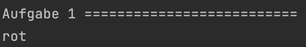
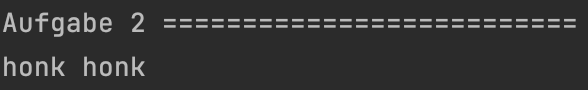
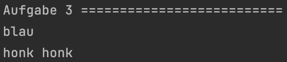
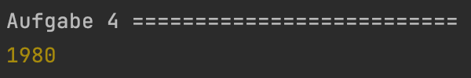
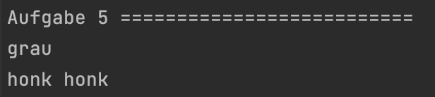

<h1 align="center">JavaScript</h1>
<h3 align="center">Lektion 5: Übungsaufgabe</h3>
 

#### Beschreibung:

- In dieser Aufgabe dreht sich alles um Klassen!
>
#### Hinweise zur Bearbeitung:

- Achte auf einen sauberen Quellcode, insbesondere Einrückungen sind wichtig!
- Dies ist eine Übungsaufgabe und dient nur als **Zusatzaufgabe**. Das Bearbeiten der
  Hauptaufgaben ist das jeweilige Ziel der einzelnen Lektionen und sollte als Priorität angesehen werden!

---

Aufgabe 1

Im ersten Teil dieser Aufgabe siehst du noch einmal, wie eine Klasse geschrieben wird. Nun nutze die vorgegebene Klasse,
um einen neuen `Apfel` namens `apfel` zu erstellen. Dieser soll die Fabre `rot` haben!

___

Zwischenergebnis

Das Ganze sollte ungefähr so in deiner Konsole aussehen. Stresse dich nicht, wenn es nicht GENAU so bei dir aussieht. Wichtig
ist nur, dass rot dort steht. Ignoriere auch alles, was unterhalb von Aufgabe 2 steht. Dazu kommen wir, wenn wir die anderen
Aufgaben bearbeiten!
>

---

Aufgabe 2

Nun schauen wir uns erneut eine Klasse an. In dieser soll eine Methode (So nennt man funktionen innerhalb von Klassen) erstellt
werden. Nenne deine Methode `hupen`. Hupen soll eine `console.debug` Funktion beinhalten. Durch diese gebe `honk honk`
aus.

___

Zwischenergebnis

Das Ganze sollte ungefähr so in deiner Konsole aussehen. Stresse dich nicht, wenn es nicht GENAU so bei dir aussieht. Wichtig
ist, dass honk honk ausgegeben wird. Ignoriere auch alles, was unterhalb von Aufgabe 3 steht. Dazu kommen wir, wenn wir 
die anderen Aufgaben bearbeiten!
>

---

Aufgabe 3

Hier wurde wieder eine komplette Klasse vorgegeben und auch schon ein Objekt mini erstellt. Gebe nun die Farbe des minis 
aus und führe auch dessen Methode aus.
**Hinweis:** Wenn du dir nicht ganz sicher bist, wie du das machen sollst, schau einmal in den vorgegebenen Code der vorherigen
Aufgaben!

___

Zwischenergebnis

Das Ganze sollte ungefähr so in deiner Konsole aussehen. Stresse dich nicht, wenn es nicht GENAU so bei dir aussieht. Wichtig
ist nur, dass blau und honk honk ausgegeben werden. Ignoriere auch alles, was unterhalb von Aufgabe 4 steht. Dazu kommen
wir, wenn wir die anderen Aufgaben bearbeiten!
>

---

Aufgabe 4

Super gemacht! Wir sind bald schon durch! Schauen wir uns jetzt noch einmal den Konstruktor genauer an. Schreibe einen Konstruktor
für unsere Klasse. In diesem wollen wir das `baujahr` als eingabe haben. Vergiss nicht, hier auch das Schlüsselwort `this` 
zu verwenden!

___

Zwischenergebnis

Das Ganze sollte ungefähr so in deiner Konsole aussehen. Stresse dich nicht, wenn es nicht GENAU so bei dir aussieht. Wichtig
ist nur, dass das Jahr 1980 ausgegeben wird. Ignoriere auch alles, was unterhalb von Aufgabe 5 steht. Dazu kommen wir, wenn 
wir die anderen Aufgaben bearbeiten!
>

---

Aufgabe 5

Sehr gut! Nun haben wir alle Einzelteile einer Klasse einmal gesehen und selbst geschrieben. Auf zum Finale: schreibe nun 
eine Klasse komplett selbst. Nenne die Klasse `Elektroauto`. Schreibe den Konstruktor. Über diesen soll nachher die `farbe`
gewählt werden. Schreibe auch die von den anderen Aufgaben bekannte Funktion `hupen`. Diese soll auch wieder `honk honk` 
ausgeben. Schlußendlich erstelle noch dein neues `Elektroauto` mit dem Namen `tesla`. Dieser soll `grau` sein.

___

Endergebnis

In dieser Übung hast du zum ersten Mal deine eigenen Klassen geschrieben und die verschiedenen Einzelteile von Klassen kennengelernt. 
Die Lösungen für Aufgaben 1 bis 4 sind jeweils in den Zwischenergebnissen, allerdings bekommst du hier nochmal alles auf
einen Blick. Am Ende sollte es bei dir ungefähr so aussehen:

> Aufgabe 1:  
> Aufgabe 2:  
> Aufgabe 3:  
> Aufgabe 4:
> Aufgabe 5:

