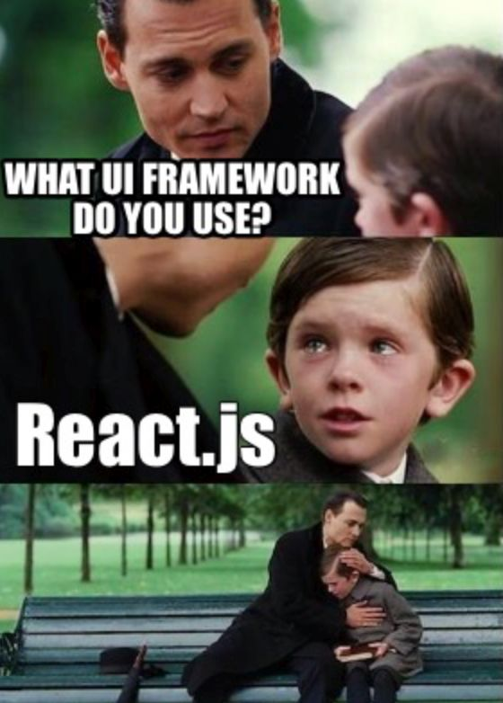
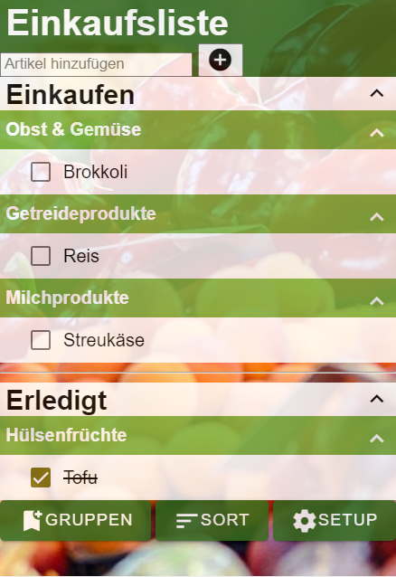
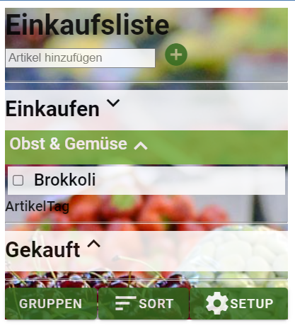
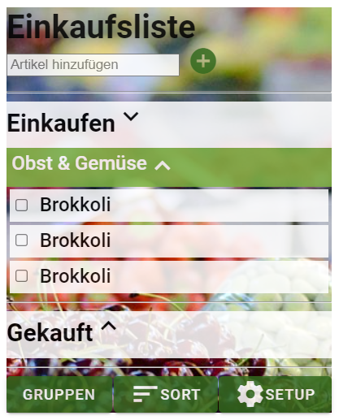

<h1 align="center">React</h1>
<h3 align="center">Lektion 1</h3>
 

  

#### Beschreibung:

- In dieser Lektion bauen wir die ersten Komponenten unserer Einkaufsliste.

#### Hinweise zur Bearbeitung:

- Achte auf einen sauberen Quellcode, insbesondere Einrückungen sind wichtig!
- Jede React-Komponente sollte in einer eigenen `.js`-Datei deklariert werden.
- HTML und JSX sind sehr ähnlich aber nicht gleich. Du musst eventuell einige Tags anpassen, damit dein HTML-Code korrekt angezeigt wird.
  
---

Aufgabe 1

1. Öffne die Datei [App.js](../src/App.js) und gehe in der `render()`-Methode zu Zeile 13.
2. Kopiere Deinen HTML-Code aus [index.html](../index.html) hier hinein.
3. Ersetze alle `class` im HTML-Code durch `className`. Schließe alle 'Single'-Tags mit `/>`. Also schreibe z.B. statt `<input>` -> `<input/>` und statt `
` -> `
`.
4. Öffne einen Terminal im Root-Verzeichnis dieses Projektes und installiere die App, indem Du folgenden Befehl ausführst: `npm install` 
5. Nachdem alles durchgelaufen ist, start die App mit folgendem Befehl: `npm start`
6. Zeige die Seite im Browser an, indem Du diese URL aufrufst:  
[http://localhost:3000](http://localhost:3000)

Falls Fehler auftreten, schau Dir die Zeile an, die im Terminal angegeben wird. Meistens fehlt ein schließender `/>` oder ein Anführungszeichen `"` oder Du hast noch `class` statt `className` geschrieben.

---

Zwischenergebnis

Das Ergebnis sollte im Browser ungefähr so aussehen:  
>

---

Aufgabe 2

1. Öffne die Datei [GruppenTag.js](../src/components/GruppenTag.js) und gehe in der `render()`-Methode zu Zeile 13.
2. Verschiebe Deinen Gruppen-Code aus [App.js](../src/App.js) hierhin. Das ist der Code innerhalb des ersten `<dl>`-Tags.
3. Ersetze in der [App.js](../src/App.js) den bisherigen Code zwischen den `<dl>`-Tags durch `<GruppenTag/>`.
4. Falls die IDE den Import nicht automatisch ergänzt, füge ihn in Zeile 2 ein: `import GruppenTag from './components/GruppenTag'`

---

Zwischenergebnis

Das Ergebnis sollte im Browser ungefähr so aussehen:  
>

---

Aufgabe 3

1. Öffne die Datei [ArtikelTag.js](../src/components/ArtikelTag.js) und gehe in der `render()`-Methode zu Zeile 12.
2. Verschiebe Deinen Artikel-Code aus [GruppenTag.js](../src/components/GruppenTag.js) hierhin. Das ist der Code mit dem `<dd>`-Tag.
3. Ersetze den bisherigen Artikel-Code im [GruppenTag.js](../src/components/GruppenTag.js) durch `<ArtikelTag/>`. Wiederhole den `<ArtikelTag/>` dreimal, um die Änderung zu sehen.
4. Falls die IDE den Import nicht automatisch ergänzt, füge ihn in Zeile 2 ein: `import ArtikelTag from './ArtikelTag'`

---

Endergebnis

Das Endergebnis sollte im Browser ungefähr so aussehen:
>

