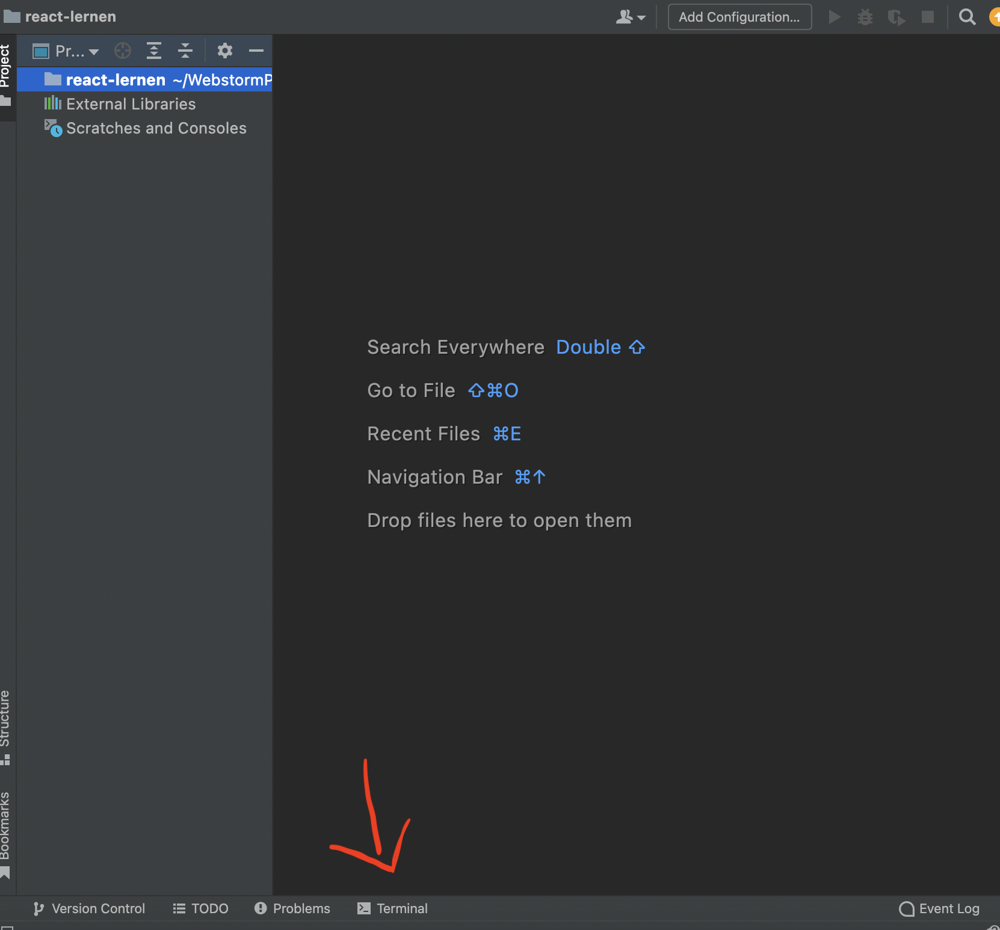
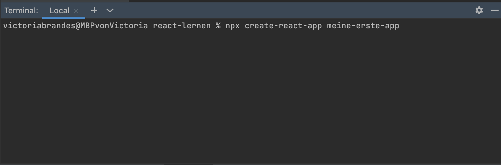
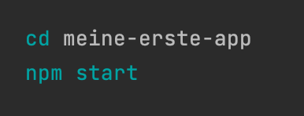
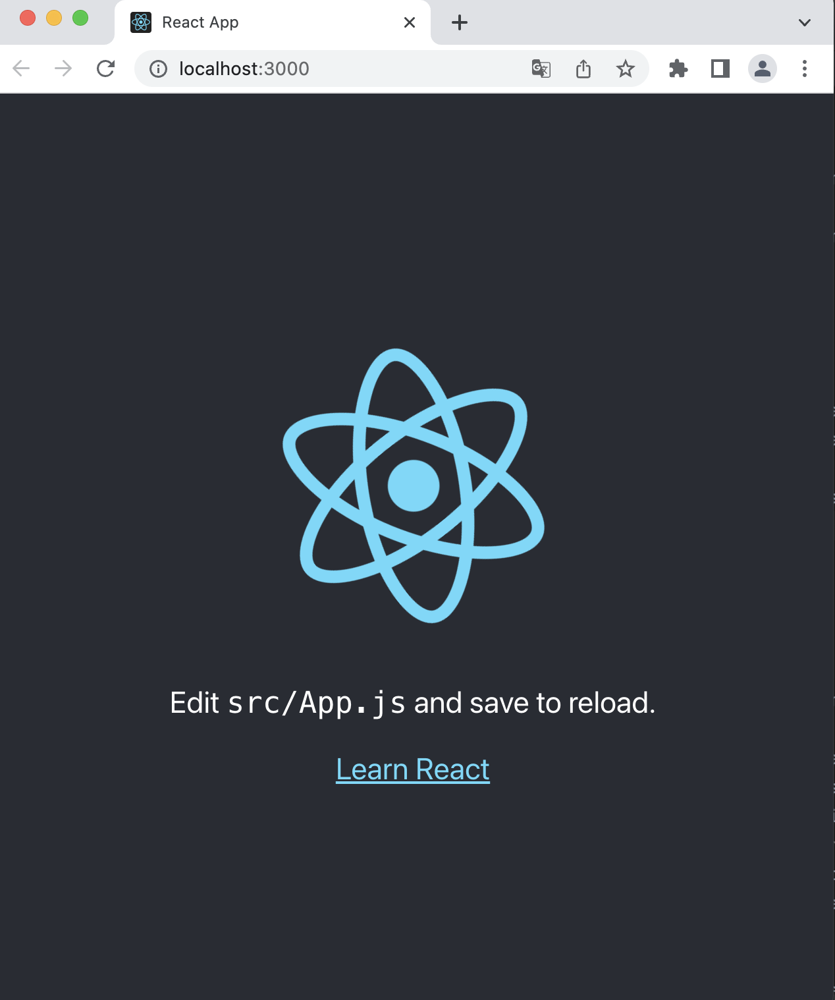
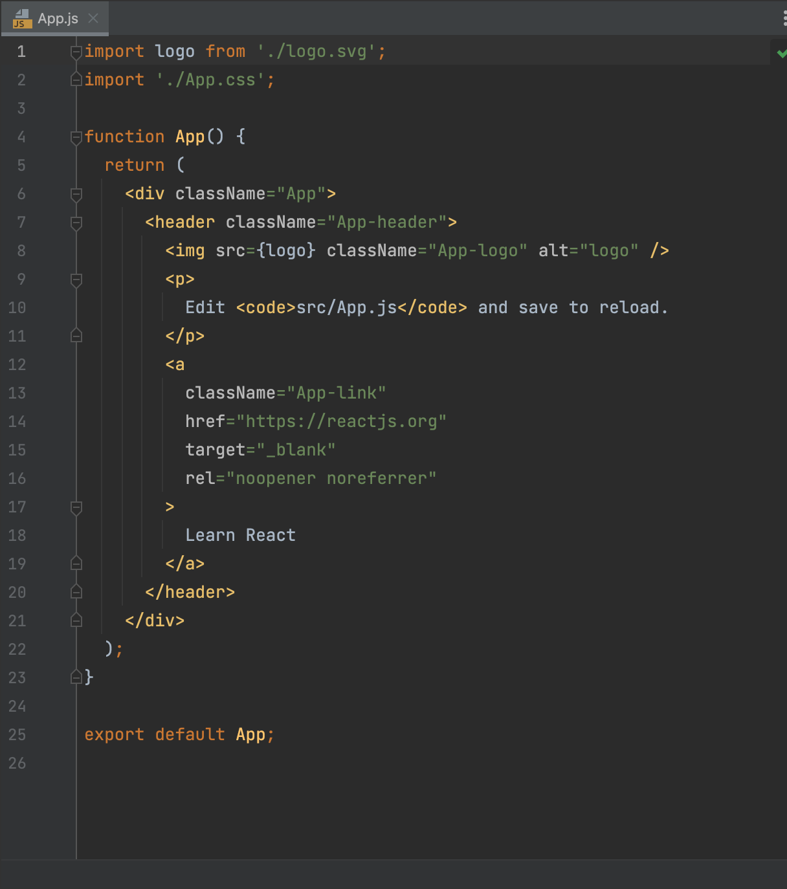
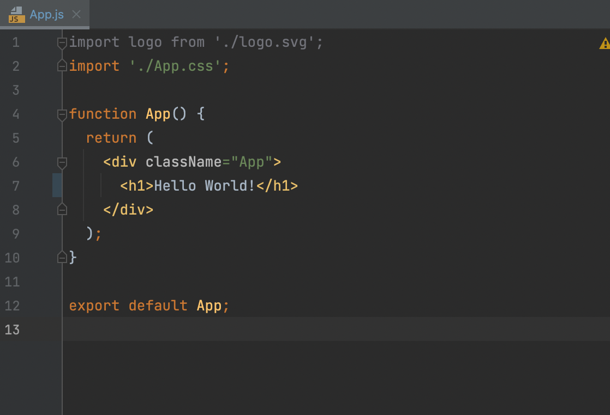
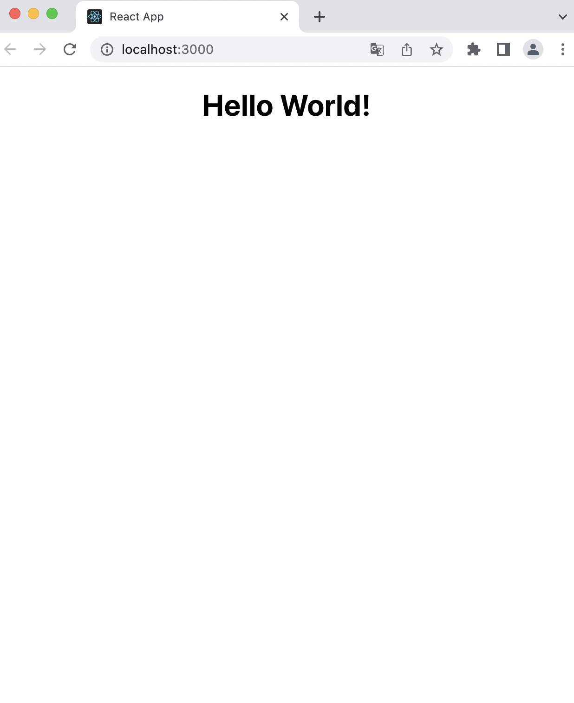
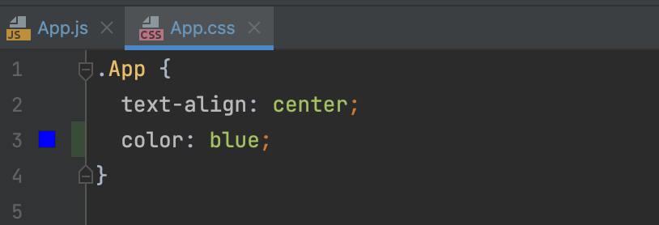
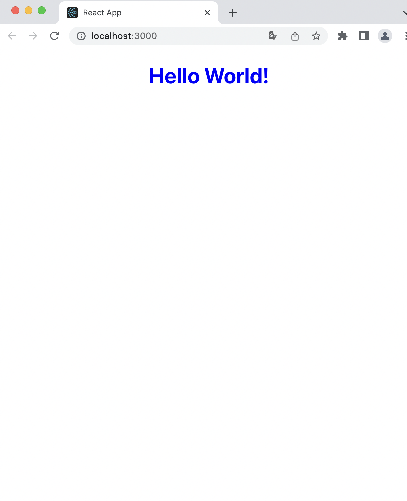

<h1 align="center">React</h1>
<h3 align="center">Übung 1</h3>
 

  

#### Beschreibung:
- In dieser Übung erstellen wir unsere erste React App Schritt für Schritt

#### Hinweise zur Bearbeitung:

- Achte auf einen sauberen Quellcode, insbesondere Einrückungen sind wichtig!
- Die App kann nach deiner eigenen Vorstellung angepasst werden. Sei kreativ!
- Wenn du Hilfe brauchst, frage gerne Google, andere Teilnehmer oder die Tutoren.
- Eine Voraussetzung für diese Aufgabe ist, dass du Node.js installiert hast, ansonsten besuche die Seite [node.js](https://nodejs.org/de/) und lade die neuste Version herunter.

---

Aufgabe 1

Öffne nun dein Webstorm und erstelle ein neues Project. Dieses soll den Namen react-lernen haben.
Und nun geht es los:
1. Öffne das Terminal
>
2. gebe nun den Befehl aus: `npx create-react-app meine-erste-app`
>
3. Deine App wird nun erstellt! Nun gibst du `cd meine-erste-app` im Terminal ein.
4. Und nun um unsere React app zu starten `npm start`
>
5. Herzlichen Glückwunsch deine erste React App ist nun erstellt und es müsste sich folgendes Fenster geöffnet haben. 
>

---

Aufgabe 2

Soweit so gut, aber wir wollen uns jetzt "Hallo Welt" ausgeben lassen. 
   

1. In der Ordnerstruktur findest du den src Ordner, öffne innerhalb dieses Ordners die `App.js`
Diese sollte so aussehen:
>
2. Ersetze nun den gesamten Inhalt innerhalb des ` 
 ` mit einem `<h1>Hello World!</h1> `
>
3. Gehe nun in deinem Browser und schaue dir an, was sich geändert hat. 
Das ganze sollte nun so aussehen: 
>

___

Aufgabe 3

Nun wollen wir die Schriftfarbe ändern. 
1. Gehe innerhalb des src-Ordners auf App.css 
2. Gehe in Zeile 3 und bleibe innerhalb der {} - Klammern füge nun 
`color: blue;` hinzu und schaue was passiert. 
>

___

Ergebnis

Durch dasIn deinem Browser unter `localhost:3000`sollte nun das ausgegeben werden. 
>

---

Aufgabe 4

Du hast die Aufgabe nun erfolgreich abgeschlossen. 
Nutze nun die restliche Zeit um dich mit React vertraut zu machen, ändere zum Beispiel nochmal die App.css oder füge deine App.js noch etwas hinzu. 

Sei kreativ und vor allem habe Freude dabei! 

___

