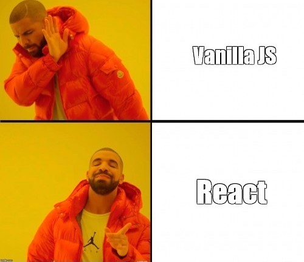
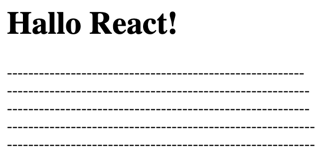
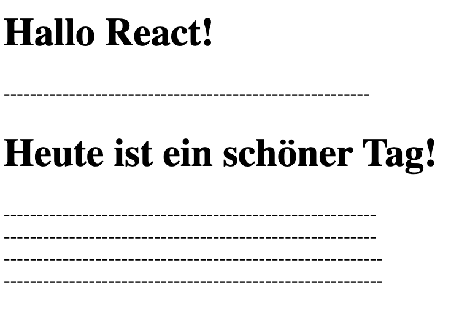
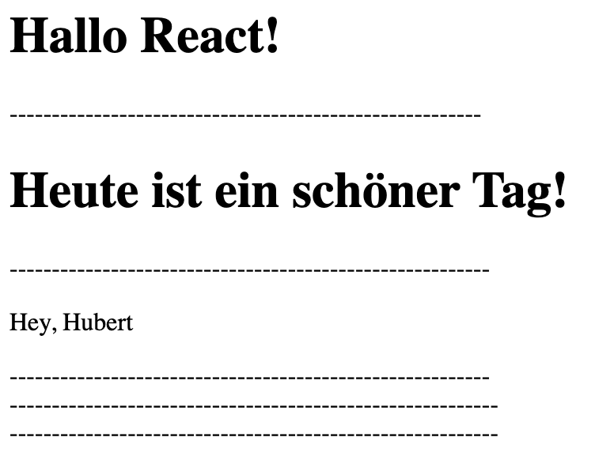
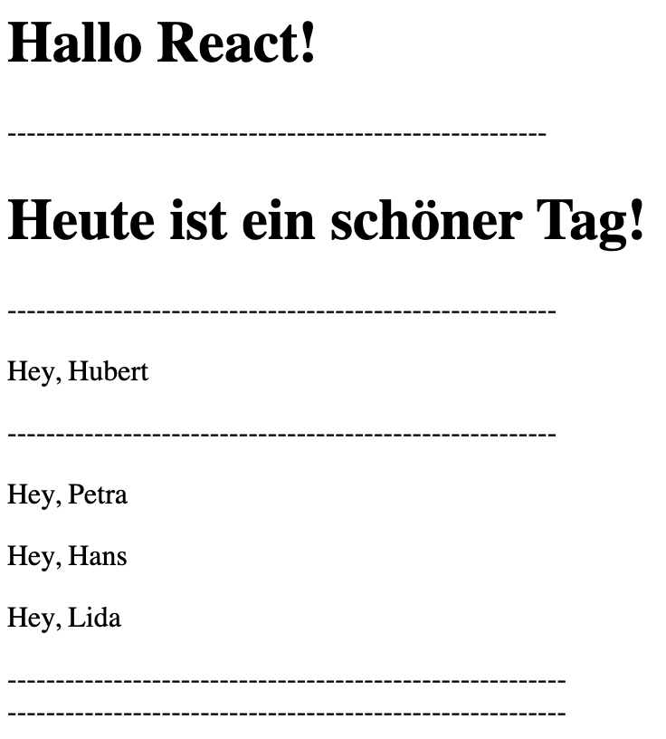
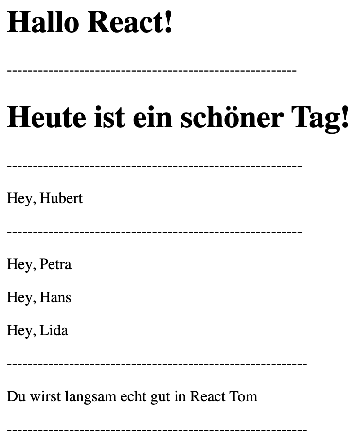
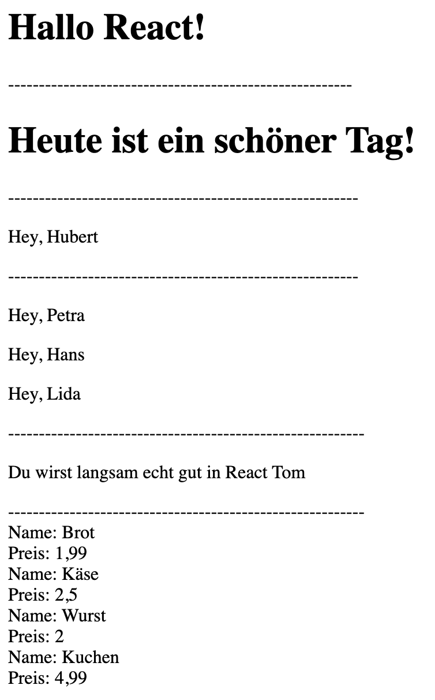

<h1 align="center">React</h1>
<h3 align="center">Lektion 1: Übungsaufgabe </h3>
<br>

<p align="center">
  
</p>

#### Beschreibung:
- In dieser Aufgabe dreht sich alles um Klassen!

#### Hinweise zur Bearbeitung:

- Achte auf einen sauberen Quellcode, insbesondere Einrückungen sind wichtig!
- Dies ist eine Übungsaufgabe und dient nur als **Zusatzaufgabe**. Das Bearbeiten der
  Hauptaufgaben ist das jeweilige Ziel der einzelnen Lektionen und sollte als Priorität angesehen werden!

---

<details>
<summary>Aufgabe 1</summary>

Für diese Übungsaufgabe werden wir den react-code innerhalb der html-file `react-uebung2` schreiben. Dies funktioniert 
nur innerhalb `<script>`-Tags und wird normalerweise außerhalb der html-file in einer eignen `.js`-file geschrieben.
<br><br>
Schreibe deinen Code nach dem ersten `ToDo` in Zeile 21.
Schreibe eine Funktion `Hallo` die dann `"Hallo React!"` als `return` zurückgeben soll. <br>
**Hinsweis:** Um Hallo React auszugeben, musst du dies in ein `html`-Tag schreiben.  
Zum Beispiel so: 
```
<h1>Hallo React!</h1>
```

</details>

___

<details>
<summary>Zwischenergebnis</summary>

Das Ganze sollte ungefähr so in deiner Konsole aussehen. Stresse dich nicht, wenn es nicht GENAU so bei dir aussieht. Wichtig
ist nur, dass dort eine Textausgabe steht.
>

</details>

---

<details>
<summary>Aufgabe 2</summary>

Gehe nun zum nächsten To-Do.  
Schreibe eine `Klasse Tag` die von React.Component erbt (`class Tag extends React.Component`) und ausgibt `Heute ist ein schöner Tag!`. Diese hat keinen Konstruktor. <br>
**Hinweis:** Denke daran, dass du eine render Funktion in der Klasse brauchst! <br>
**Hinweis 2:** Um "Heute ist ein schöner Tag" auszugeben, kannst du dich and er Aufgabe 1 orientieren 


</details>

___

<details>
<summary>Zwischenergebnis</summary>

Das Ganze sollte ungefähr so in deiner Konsole aussehen:
>

</details>

---

<details>
<summary>Aufgabe 3</summary>

Nun geht es weiter unter dem nächsten ToDo.  
Schreibe nun eine Funktion mit dem Namen `Hey`. Diese soll deinen Namen mithilfe des Schlüsselwortes `props` in folgender Form ausgeben: `Hey, (dein Name)`. <br>
**Hinweise:** Die Verwendung von `props` in einer Funktion sollte im Header wie folgt aussehen: `function Hey(props) { ... }`. <br>
Und innerhalb des `returns` kannst du so auf die `props` zugreifen: `{props.name}`

</details>

___

<details>
<summary>Zwischenergebnis</summary>

Das Ganze sollte ungefähr so in deiner Konsole aussehen:
>

</details>

---

<details>
<summary>Aufgabe 4</summary>

Super gemacht! Gehe nun zum nächsten Abschnitt mit dem nächsten ToDo.  
Schreibe hier eine Funktion mit dem Namen `Wiederholt`. Diese soll mehrere Namen grüßen. Die Namen darfst du frei wählen. <br>
**Hinweis:** An dieser Stelle kannst du die Funktion `hey` aus der Aufgabe zuvor wiederverwenden und diese mehrmals aufrufen.

</details>

___

<details>
<summary>Zwischenergebnis</summary>

Das Ganze sollte ungefähr so in deiner Konsole aussehen.
>

</details>

---

<details>
<summary>Aufgabe 5</summary>

Sehr gut! Langsam wirst du immer besser in React! Schreibe nun eine `class Vorname`, welche von React.Component erbt und mithilfe von `props`
deinen Namen in folgendem Satz ausgibt: `Du wirst langsam echt gut in React (dein Name)`.
**Hinweis:** Um `props` in Klassen zu verwenden benutze einfach folgende Zeile in deinem return: `{this.props.name}`

</details>

___

<details>
<summary>Zwischenergebnis</summary>

Das Ganze sollte ungefähr so in deiner Konsole aussehen.
>

</details>

---

<details>
<summary>Aufgabe 6</summary>

Fast geschafft! Das ist die letzte Aufgabe! Als allerletztes musst du nun nur noch `ReactDOM.render` schreiben können, so wie es in allen bisherigen Aufgaben vorgegeben war.
An diesen kannst du dich orientieren! :) 

</details>

___

<details>
<summary>Ergebnis</summary>
Wenn all die ToDo´s erledigt sind, sollte folgendes auf der Website angezeigt werden:

>

</details>

<br><br>