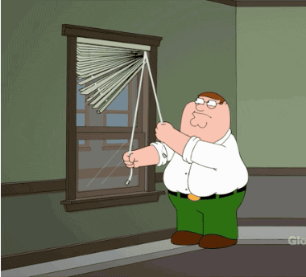

<h1 align="center">React</h1>
<h3 align="center">Übung 3</h3>
 

  

#### Beschreibung:
- In dieser Übung bearbeiten wir eine React App um den `state` von Komponenten zu ändern.

#### Hinweise zur Bearbeitung:

- Der Zweck dieser Übung ist euch mit dem `state` vertraut zu machen, aber auch, euch
an die Struktur eines vernünftigen React-Projekt zu gewöhnen.
- Die Komponenten `Counter.js`, `LikeButton.js` und `UnlikeButton.js` befinden sich in `src/Components`.
- Achte auf einen sauberen Quellcode, insbesondere Einrückungen sind wichtig!
- Wenn du Hilfe brauchst, frage gerne Google, andere Teilnehmer oder die Tutoren.

---

Aufgabe 1

1. Öffne das Terminal und gebe den Befehl aus: `cd react3`

2. Um das Projekt zu installieren, gebe den Befehl aus: `npm install`

3. Und nun um die React app zu starten, gebe den Befehl aus `npm start`

---

Zwischenergebnis

> 

---

Aufgabe 2

Gehe nun in die Komponente `Counter.js` und verändere:
- Im Konstruktor, setze den initialen state von `counter` auf `0`. 
- Nutze nun innerhalb der Funktion `increaseCounter()` die Methode `setState()`. 
  Diese soll den `counter` um eins erhöhen. (`counter+1`)

___

Aufgabe 3

Gehe nun in die Komponenten `LikeButton.js` und `UnlikeButton.js` und verändere:
- Im Konstruktor von `LikeButton.js`, setze den initialen state von `liked` auf `false`.
- Im Konstruktor von `UnlikeButton.js`, setze den initialen state von `liked` auf `false`.

___

## Endergebnis

Das Endergebnis sollte ungefähr so aussehen:
> 

Durch Klicken auf die ersten beiden Buttons, soll der jeweilige Button verschwinden und eine andere Nachricht angezeigt werden.
  Der dritte Button soll den Zähler bei jedem Klick um +1 erhöhen.

> 
