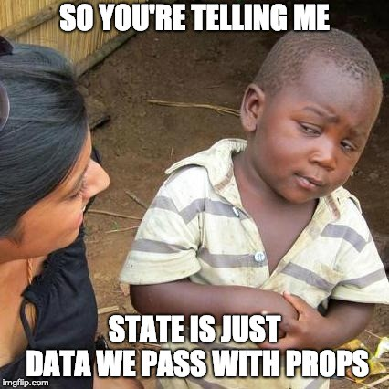
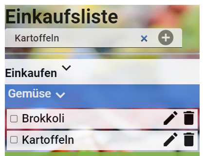
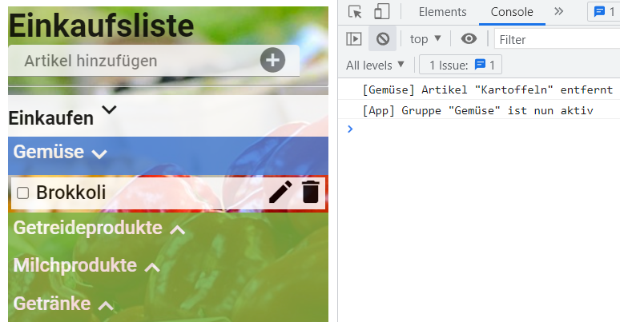

<h1 align="center">React</h1>
<h3 align="center">Lektion 3</h3>
 

  

#### Beschreibung:

- In dieser Lektion programmieren wir das UI der Artikel-Funktionen.

#### Hinweise zur Bearbeitung:

- Achte auf einen sauberen Quellcode, insbesondere Einrückungen sind wichtig!
- Jede React-Komponente sollte in einer eigenen `.js`-Datei deklariert werden.
- HTML und JSX sind sehr ähnlich aber nicht gleich. Du musst eventuell einige Tags anpassen, damit dein HTML-Code korrekt angezeigt wird.
  
---

Aufgabe 1 - Artikel erledigen / reaktivieren

1. Öffne die Datei [App.js](../src/App.js) und vervollständige die `artikelChecken(artikel)`-Methode. Programmiere folgenden Code darin:
   1. Die `gekauft`-Variable des übergebenen `artikel` soll sich beim Ausführen der Methode verändern(von `true` zu `false` oder andersrum).
   2. Deklariere eine Variable `aktion`, welche abhängig von `artikel.gekauft` "erledigt" oder "reaktiviert" ergibt. Verwende dafür den "ternären Operator": `let variable = (bedingung) ? trueWert : falseWert`
   3. Rufe `App.informieren()` auf und gib aus, ob der Artikel erledigt oder reaktiviert wurde.
   4. Aktualisiere den `state` 
2. Starte die App mit folgendem Befehl: `npm start`
3. Teste die App im Browser8, indem Du diese URL aufrufst:  
[http://localhost:3000](http://localhost:3000)

**Ergebnis:** du solltest nun die Artikel in der Einkaufsliste durch anklicken von "Einkaufen" zu "Erledigt" verschieben
können und andersrum.

---

Zwischenergebnis

Das Ergebnis sollte im Browser ungefähr so aussehen:  
>

---

Aufgabe 2 - Artikel hinzufügen

1. Öffne die Datei [App.js](../src/App.js) und vervollständige die`artikelHinzufuegen()`-Methode. Programmiere folgenden Code darin:
2. Deklariere eine Variable namens `eingabe` und weise ihr das Ergebnis von `document.getElementById("artikelEingabe")` zu.
3. In `eingabe.value` steht, was der User eingegeben hat. Wenn die User-Eingabe mehrere Buchstaben enthält (also die `length` größer als 0 ist), dann:
   1. Füge mittels `Modell.aktiveGruppe.artikelHinzufuegen()` einen Artikel hinzu. Der Name des neuen Artikels ergibt sich aus `eingabe.value`.
   2. Aktualisiere den State, um den neuen Artikel sichtbar zu machen.
4. Lösche in jedem Fall die User-Eingabe wieder.
5. Setze mit `eingabe.focus()` den Cursor wieder ins Eingabefeld, damit der User direkt weitere Artikel eingeben kann.

**Ergebnis:** du solltest nun einen Artikel in das Eingabefeld eingeben und per Klick auf den Plus-Button der aktiven Gruppe
hinzufügen können. Danach sollte sich das Eingabefeld leeren.

---

Zwischenergebnis

Das Ergebnis sollte im Browser ungefähr so aussehen:  
>

---

Aufgabe 3 - Artikel entfernen

1. Öffne die Datei [GruppenTag.js](../src/components/GruppenTag.js) und vervollständige die`artikelEntfernen()`-Methode. Programmiere folgenden Code darin:
2. Die aktuelle Gruppe wird mittels 'gruppe-prop' übergeben. Du kannst über `this.props.gruppe` auf alle ihre Methoden zugreifen, u.a. `artikelEntfernen()`. Rufe deshalb `this.props.gruppe.artikelEntfernen()` auf und übergib den `name`-Parameter.
3. Nach dem Löschen des Artikels soll diese Gruppe aktiviert werden, damit der User weitere Artikel darin eingeben kann. Aktiviere sie, indem Du den `aktiveGruppeHandler`, aufrufst, der als `prop` übergeben wurde. Verwende dabei die aktuelle Gruppe als Argument.

**Ergebnis:** per Klick auf das Mülleimer-Icon sollte nun der entsprechende Artikel gelöscht werden und seine Gruppe aktiviert werden.

---

Endergebnis

Das Endergebnis sollte im Browser ungefähr so aussehen:
>

