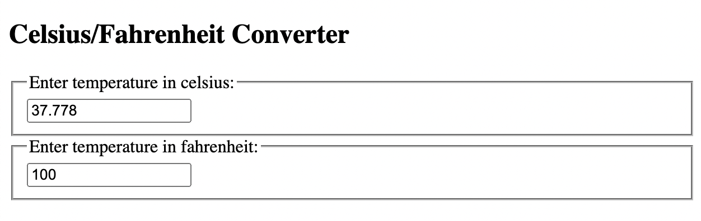

<h1 align="center">React</h1>
<h3 align="center">Übung 3b</h3>
<br>

<p align="center">
  
</p>


#### Beschreibung:
In dieser Übung bearbeiten wir einen Konverter, der mithilfe eines übergeordneten States synchron zwischen
Fahrenheit und Celsius umrechnet.

Dazu benutzen wir nur einen einzigen State anstatt zwei seperaten States für die Speicherung der Temperatur.

Dadurch kann die App parallel den Inhalt des anderen Input-Felds verändern, während wir nur eines der beiden
Felder bearbeiten.
#### Hinweise zur Bearbeitung:


- Der Zweck dieser Übung ist es, euch mit dem `state` vertraut zu machen, aber auch, euch
an die Struktur eines vernünftigen React-Projekts zu gewöhnen.
- Die Komponenten `Calculator.js` und `TemperatureInput.js` befinden sich in `src/Components`.
- Achte auf einen sauberen Quellcode, insbesondere Einrückungen sind wichtig!
- Wenn du Hilfe brauchst, frage gerne Google, andere Teilnehmer oder die Tutoren.

---
<details>
<summary>Aufgabe 1</summary>


1. Öffne das Terminal und gib den folgenden Befehl ein: `cd react3b`

2. Um das Projekt zu installieren, gib dann den folgenden Befehl ein: `npm install`

3. Um die React App nun zu starten, gib den Befehl ein: `npm start`

</details>

---

<details>
<summary>Aufgabe 2</summary>

Wir beginnen unsere App damit, in der Komponente `TemperatureInput.js` die beiden Props
`scale` und `temperature` zu benutzen.

Gehe dazu in die ``render()`` Methode.

Lösche dort die festen Werte, welche im Moment noch den beiden Variablen `scale` und `temperature` zugewiesen werden,
und ersetze sie durch jeweilige props-Aufrufe.

Erinnerung: props kann man über ```this.state.attributName``` abrufen.
</details>

___

<details>
<summary>Aufgabe 3</summary>

In dieser Aufgabe verwenden wir den State der Komponente ``Calculator.js``.

Ändere ganz am Anfang der ``render()``-Methode die beiden Variablen scale und temperature, sodass
beide anstatt eines festen Werts den Wert von ``this.state`` mit dem jeweiligen Attribut zugewiesen bekommen.
</details>

___

<details>
<summary>Zwischenergebnis</summary>

Unsere App sollte nun so weit sein, dass du in der Klasse ```Calculator.js```
im constructor den Startwert des States (Zeile 9) verändern kannst,
wodurch sich auch die Input-Felder im Browser verändern sollten.

Im Screenshot wurde beispielsweise der Wert 100 bei ``temperature`` eingespeichert.

> 

Gib ruhig ein paar verschiedene Werte ein und überprüfe, dass diese in Celsius umgerechnet werden.

</details>

___


<details>
<summary>Aufgabe 4</summary>

Nun verändern wir die beiden Funktionen 
`handleCelsius` sowie `handleFahrenheit` in der Komponente `Calculator.js`. 

In beiden soll der State der Komponente neu gesetzt werden (d.h. durch this.setState() ).
- In `handleCelsius` soll das `scale`Attribut auf den Wert `'c'` gesetzt werden und das `temperature`Attribut auf den
  Wert des Parameters `temperature`
- In `handleFahrenheit` soll das `scale`Attribut auf den Wert `'f'` gesetzt werden und das `temperature`Attribut auf den
  Wert des Parameters `temperature`

Diese beiden Funktionen werden aufgerufen, wenn das jeweilige Input-Feld im Browser
mit einem Wert gefüllt wird. Dadurch verändern Sie den State der Calculator-Komponente.
Diese kann dann durch den geänderten State sofort den neuen Wert für das andere Input-Feld berechnen
und als Prop übergeben.

</details>

___

<details>
<summary>Zwischenergebnis</summary>

Der Calculator funktioniert jetzt schon fast ganz. Du solltest jetzt schon im Fahrenheit-Feld
einen Wert eingeben können, welcher automatisch umgerechnet ins celsius-Feld geschrieben wird.

Das celsius-Feld hingegen funktioniert noch nicht ganz, was wir in der nächsten Aufgabe lösen.
</details>

___

<details>
<summary>Aufgabe 5</summary>

Damit unsere App auch von Celsius in Fahrenheit umrechnet, müssen wir mithilfe einer
state-Abfrage überprüfen, in welcher Einheit unsere Temperatur gerade abgespeichert ist.

Hat das ```scale```-Attribut aus dem State der Calculator-Klasse den Wert ``'c'``,
so beschreibt das ```temperature```-Attribut aus dem State die Temperatur in Celsius. Somit muss
der Fahrenheit-Wert noch berechnet werden.

All dies ist bereits implementiert, jedoch musst du noch eine if-Bedingung hinzufügen, sodass die jeweils
andere Einheit berechnet wird. 

Gehe dazu in die ```render()```-Methode der Calculator-Klasse und ändere die if-Bedingung zu einem
Vergleich, ob die ```scale``` den Wert `'c'` hat.

</details>


## Endergebnis

Die fertige App sollte nun, während du eines der beiden Felder veränderst, parallel dazu
den Wert in der anderen Skala berechnen und in das andere Feld schreiben.

