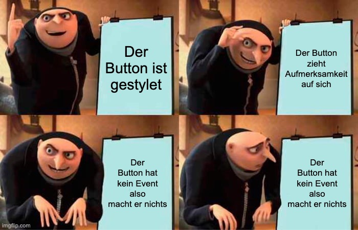
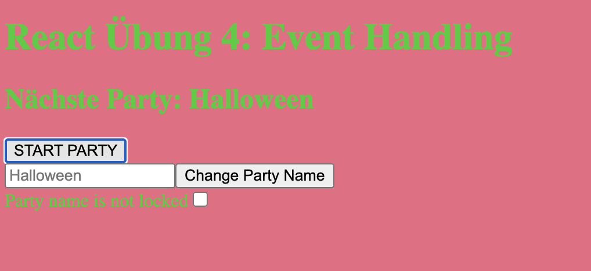
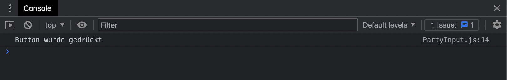
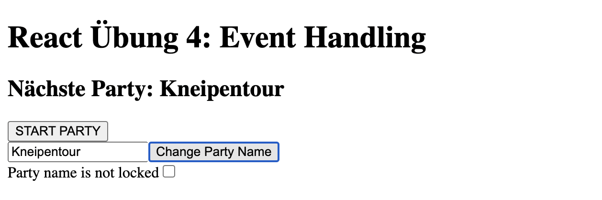

<h1 align="center">React</h1>
<h3 align="center">Übung 4</h3>
 

  

#### Beschreibung:
In dieser Übung bearbeiten wir einen sehr simplen Party-Planer, der mithilfe mehrerer Knöpfe
dem User die Option bietet, eine neue Party zu benennen und zu starten.
#### Hinweise zur Bearbeitung:

- Der Zweck dieser Übung ist es, dich mit `Events` vertraut zu machen und die verschiedenen
  Ereignisse kennenzulernen, die von Komponenten ausgelöst werden können.
- Die Komponenten `PartyButton.js`, `PartyInput.js` und `PartyLock.js` befinden sich in `src/Components`.
- Achte auf einen sauberen Quellcode. Insbesondere Einrückungen sind wichtig!
- Wenn du Hilfe brauchst, frage gerne Google, andere Teilnehmer oder die Tutoren.

---

Aufgabe 1

1. Öffne das Terminal und gib den folgenden Befehl ein: `cd react4`

2. Um das Projekt zu installieren, gib dann den folgenden Befehl ein: `npm install`

3. Um die React App nun zu starten, gib den Befehl ein: `npm start`

---

Aufgabe 2

Wir beginnen damit, in der Komponente `PartyButton.js` ein Event zu erstellen.
Dies soll bewirken, dass sobald der Knopf gedrückt wird, eine Funktion der Klasse ausgeführt wird.

Ein Event wird z.B. mit onClick angegeben. Die danach im Code angegebene Funktion wird dann
ausgeführt, wenn das Input-Feld einen Klick registriert.

####Ein Code-Beispiel 

`<button onClick={this.funktionenName}></button>`führt die Funktion
funktionenName() aus, sobald dieser Knopf gedrückt wird.

Deine Aufgabe ist es nun, in der Datei `PartyButton.js` dem Knopf ein onClick-Event zu geben,
sodass die Funktion startParty ausgeführt wird, wenn der User diesen drückt.

Orientiere dich dabei für die richtige Schreibweise ruhig am oberen Code-Beispiel.

___

Zwischenergebnis

Jetzt sollte, sobald du den ``START PARTY``-Knopf drückst, die Webseite anfangen, vollkommen 
durcheinander die Farben zu wechseln.

Nach einer gewissen Zeit zeigt die Webseite wieder die ursprünglichen schwarz 
und weiß Farben an.

> 

___

Aufgabe 3

In dieser Aufgabe bearbeiten wir die `render`-Methode der Komponente `PartyInput.js`.

Ziel ist, auch diesem Knopf ein onClick-Event zu geben, sodass die Funktion ``onButtonClick`` 
ausgeführt wird.

Du kannst dich hierfür an der vorherigen Aufgabe orientieren.

___

Zwischenergebnis

Der Knopf ``Change Party Name `` macht jetzt zwar noch nichts Sichtbares in der App,
aber er gibt auf der Konsole aus, dass er gedrückt wurde.

Du kannst dies überprüfen, indem du in der App einen Rechtsklick machst und auf
`Untersuchen` drückst, sodass dir die Konsole angezeigt wird.

Drückst du nun auf den Knopf, sollte in der Konsole eine Meldung ``Button wurde gedrückt``
erscheinen.

> 

___

Aufgabe 4

Nun geben wir dem gerade bearbeiteten Knopf eine richtige Funktion. Er soll den Inhalt des
Textfelds in die Überschrift schreiben. 

Somit kann der User dann die nächste Party in das Text-Feld schreiben und mithilfe
des Knopfs als nächste Party speichern.

Damit das funktioniert, müssen wir die Funktion `onButtonClick` in der Komponente 
``PartyInput.js`` verändern.

Der Inhalt des Textfelds wird bereits im state gespeichert. Wir können ihn somit
über this.state.input einfach abrufen.

Rufe nun die Funktion ``handleInput`` auf, welche als prop in der Komponente verfügbar. Übergib der Funktion 
als Argument den Input des Textfelds (also über this.state.input).

___

Zwischenergebnis

Schreibst du nun einen neuen Partynamen in das Textfeld, sollte dieser durch das Drücken 
des Knopfs in die Überschrift eingefügt werden.

> 

___

Aufgabe 5

In unserer letzten Aufgabe benutzen wir ein onChange-Event anstatt eines onClick-Events.

Wir wollen den Partynamen schreibgeschützt machen, solange die Checkbox markiert ist.

Gehe dafür in die Komponente ``PartyLock.js``.
Wir schreiben nun im `input`-Tag der `render`-Funktion ein onClick-Event und weisen diesem
die Funktion `handleLock` zu. 

Die Funktion ``handleLock`` erreichen wir wieder einmal über die props. Also über 
``this.props.handleLock``

## Endergebnis

Setzt du nun einen Haken bei der Checkbox und drückst auf den ``Change Party Name``-Knopf,
so sollte sich der Name in der Überschrift nicht verändern. 
Er ist also jetzt schreibgeschützt!

Entfernst du durch ein erneutes Klicken den Haken, so sollte der Knopf wieder seinen
ursprünglichen Zweck erfüllen.