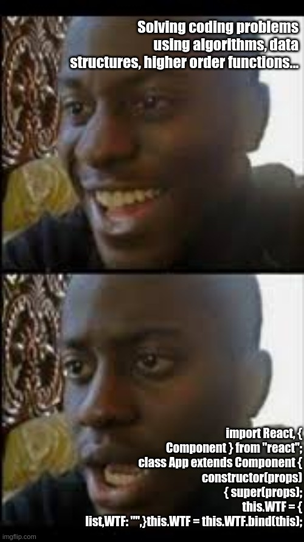
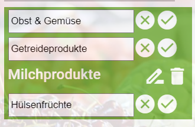
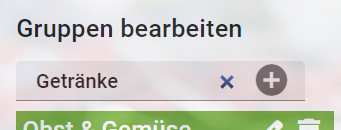
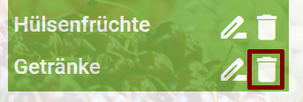

<h1 align="center">React</h1>
<h3 align="center">Lektion 4</h3>
 

  

#### Beschreibung:

- In dieser Lektion programmieren wir das UI der Gruppen-Funktionen.

#### Hinweise zur Bearbeitung:

- Achte auf einen sauberen Quellcode, insbesondere Einrückungen sind wichtig!
- Jede React-Komponente sollte in einer eigenen `.js`-Datei deklariert werden.
- HTML und JSX sind sehr ähnlich aber nicht gleich. Du musst eventuell einige Tags anpassen, damit dein HTML-Code korrekt angezeigt wird.
  
---

Aufgabe 1 - Gruppe umbenennen

1. Öffne die Datei [GruppeBearbeitenTag.js](../src/components/GruppeBearbeitenTag.js) und vervollständige die `handleChange()`-Methode. Programmiere folgenden Code darin:
   1. Deklariere eine Variable `gruppenName` und weise ihr den Wert von `event.target.value` zu.
   2. Aktualisiere den `state.newName` mit `gruppenName`.
2. Vervollständige in der gleichen Klasse die `gruppeUmbenennen()`-Methode. Programmiere folgenden Code darin:
   1. Weise dem übergebenen Argument `gruppe.name` den Wert von `this.state.newName` zu.
   2. Aktualisiere den `state.isEditing` mit `false`.
3. Starte die App mit folgendem Befehl: `npm start`
4. Teste die App im Chrome-Browser, indem Du diese URL aufrufst:  
[http://localhost:3000](http://localhost:3000)

**Ergebnis:** du solltest zwischen View- und Edit-Mode umschalten können und Gruppen umbenennen können.

---

Zwischenergebnis

Das Ergebnis sollte im Browser ungefähr so aussehen:  
>

---

Aufgabe 2 - Gruppe hinzufügen

1. Öffne die Datei [GruppenDialog.js](../src/components/GruppenDialog.js) und vervollständige die`gruppeHinzufuegen()`-Methode. Programmiere folgenden Code darin:
2. Deklariere eine Variable namens `eingabe` und weise ihr das Ergebnis von `document.getElementById("eingabe")` zu. In `eingabe.value` steht, was der User eingegeben hat. 
3. Deklariere eine Variable namens `gruppenName` und weise ihr den Wert von `eingabe.value.trim()` zu. 
4. Wenn die User-Eingabe mehrere Buchstaben enthält (also die `gruppenName.length` größer als 0 ist), dann:
   1. Füge mittels `Modell.gruppeHinzufuegen()` eine neue Gruppe hinzu. Verwendet `gruppenName` als Argument.
   2. Aktualisiere die `state.gruppenListe`, um die neue Gruppe sichtbar zu machen.
5. Lösche in jedem Fall die User-Eingabe wieder.
6. Setze mit `eingabe.focus()` den Cursor wieder ins Eingabefeld, damit der User direkt weitere Gruppen eingeben kann.

**Ergebnis:** du solltest nun einen Gruppe in das Eingabefeld eingeben und per Klick auf den Plus-Button oder Betätigen der Enter-Taste hinzufügen können. Danach sollte sich das Eingabefeld leeren.

---

Zwischenergebnis

Das Ergebnis sollte im Browser ungefähr so aussehen:  
>

---

Aufgabe 3 - Gruppe entfernen

1. Öffne die Datei [GruppenDialog.js](../src/components/GruppenDialog.js) und vervollständige die`gruppeEntfernen()`-Methode. Programmiere folgenden Code darin:
2. Rufe `Modell.gruppeEntfernen()` auf und übergib den `name`-Parameter.
3. Aktualisiere die `state.gruppenListe`, um die geänderte Gruppen-Liste sichtbar zu machen.

**Ergebnis:** per Klick auf das Mülleimer-Icon sollte nun die entsprechende Gruppe gelöscht werden.

---

Endergebnis

Das Endergebnis sollte im Browser ungefähr so aussehen:
>

