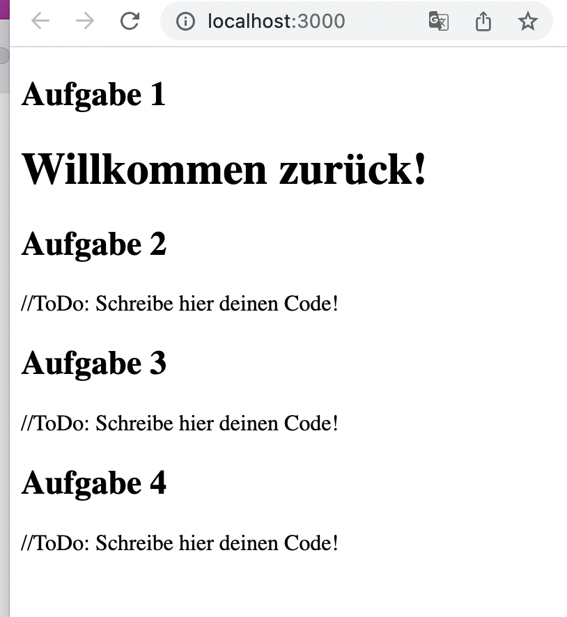
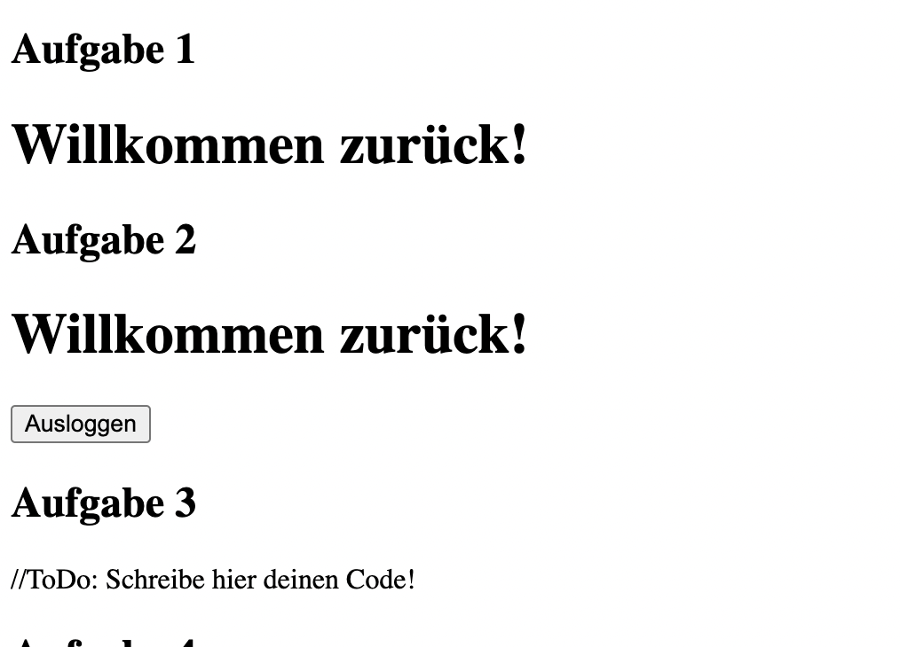
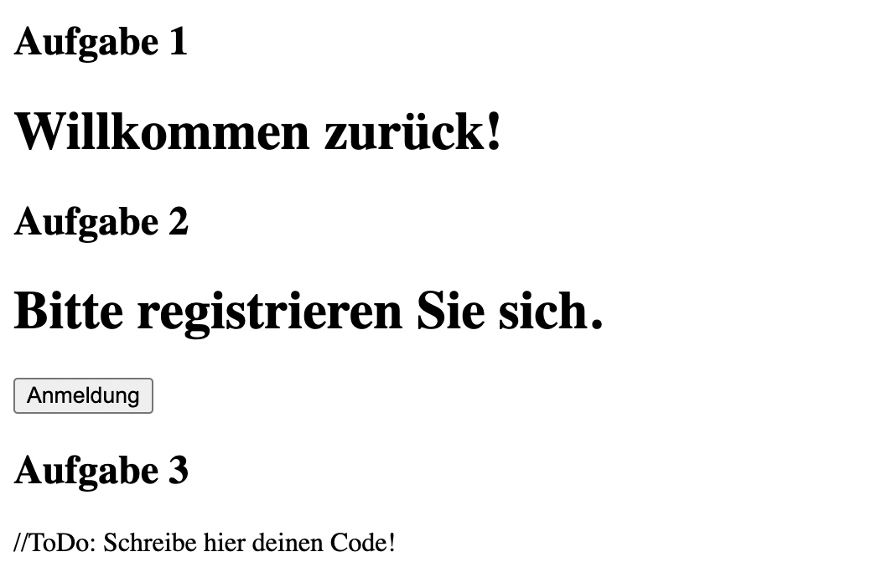
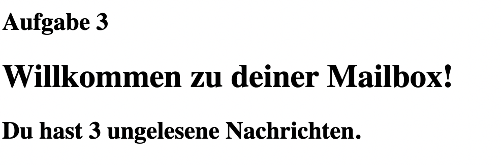
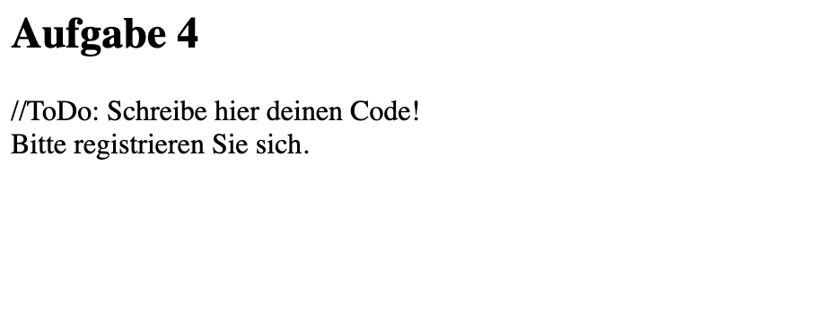
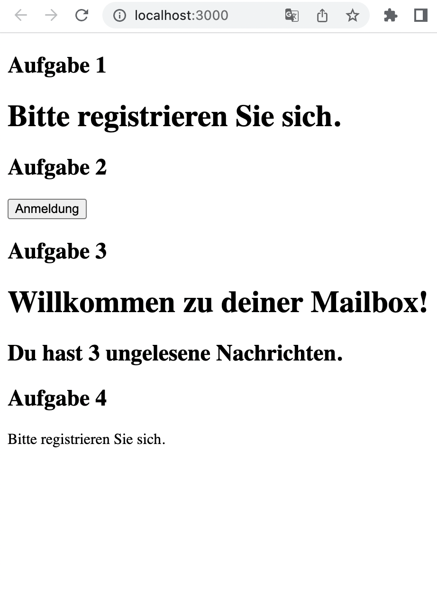

# React

Hinweise zur Bearbeitung:

- Dies ist eine Übungsaufgabe und dient nur als **Zusatzaufgabe**. Das Bearbeiten der
  **Einkaufslistenapp** ist das jeweilige Ziel der einzelnen Lektionen und sollte als Priorität angesehen werden.
- Achte auf einen sauberen Quellcode, insbesondere Einrückungen sind wichtig!

---

## Lektion 5a - Übungsaufgaben

1. Zum Einstieg schaue dir einmal den Code im Components Ordner in der Uebung5a.js zu Aufgabe 1 an. Vertausche an der geforderten Stelle in der App.js
   `false` und `true` und beobachte, wie sich die Ausgabe verändert, nachdem du in diesem Verzeichnis mit `cd uebung5a` die App mit `npm start` gestartet hast. Gute Neuigkeiten: Wenn du verstanden hast,
   warum sich die Ausgabe ändert, dann hast du bereits das Grundprinzip der gesamten Lektion verstanden!

>
>
---

2. Weiterführend benutzen wir nun if und else, um nicht manuell im Code zwischen true und false wechseln zu müssen.
   Dazu programmiere innerhalb der sich im Components- Ordner befindenen Uebung5a.js `Funktion Gruesse2` eine `if-else Abfrage`, welche entweder die `Funktion NutzerGruss2`
   oder `GastGruss2` zurückgeben soll. Zuletzt solltest du dann in Chrome einen Button haben, welcher dich einloggt und wieder
   ausloggt. 

>
>
___

3. Als Nächstes benutzen wir den && Operator. In diesem Code wird ein System geschrieben, was es uns erlaubt, die Anzahl
   von Nachrichten in einer Mailbox wiederzugeben. Der `&& Operator` erlaubt es uns, nur eine Nachricht auszugeben, wenn wir
   auch wirklich Nachrichten vorliegen haben.
   Benutze dazu die Länge des Arrays `ungeleseneNachrichten` und verbinde diese Bedingung mit der Überschrift `h2`.
   **Hinweis:** Wenn du Zeit hast, spiele mal ein wenig mit dem `Nachrichtenarray` herum. Schau mal, was passiert,
   wenn du Nachrichten hinzufügst, wegnimmst und wenn überhaupt keine Nachrichten im Array vorhanden sind!
   

>
---

4. Zu guter Letzt benutzten wir nun noch einmal den sogenannten ternären Operator (`Aussage ? Option 1 : Option 2`). Benutze
   diesen in der noch fehlenden `render Funktion` in der Uebung5a.js. Wenn der aktuelle `state von isLoggedIn` wahr ist, soll `Willkommen zurück!` ausgegeben
   werden. Andernfalls soll `Bitte registrieren Sie sich.` ausgegeben werden.  
   Um zu schauen, ob dein Code richtig ist, vertausche wie in der ersten Aufgabe true und false.
   Füge `NutzerGruessung` deiner App.js unter der Aufgabe 4 hinzu, sowie in den Aufgaben zuvor, um dein Ergebnis im Browser zu sehen. Importiert ist es schon :) 

>
>
---

##Endergebnis
Am Ende sollte das Ganze ungefähr so aussehen:
>  